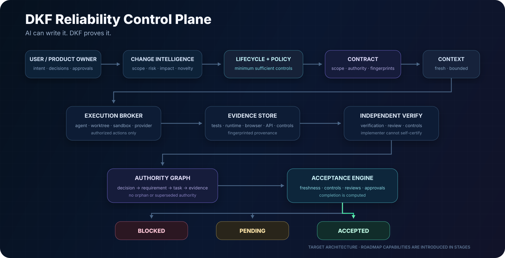
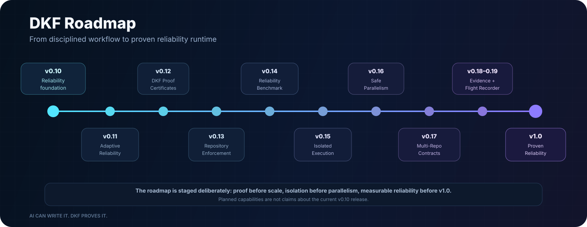

<div align="center">


# Development Kit Framework (DKF)

### The reliability control plane for agentic software development.

[](https://github.com/eybersjp/development-kit/actions/workflows/ci.yml)
[](https://www.npmjs.com/package/development-kit)
[](https://github.com/eybersjp/development-kit/releases)
[](LICENSE)
[](package.json)

**AI can write it. DKF proves it.**

[Get started](#quick-start) · [Reliability model](#reliability-control-plane) · [Strategy](STRATEGY.md) · [Roadmap](ROADMAP.md) · [Documentation](docs/README.md) · [Releases](https://github.com/eybersjp/development-kit/releases)

</div>

---

## Why DKF?

AI coding agents are increasingly capable of planning, implementing, debugging, testing, and reviewing software. The harder engineering problem is **trust**.

When an implementation agent says a task is complete:

- Were the right requirements actually implemented?
- Were authoritative sources changed after the work began?
- Did required security, architecture, accessibility, or design controls run?
- Is the verification independent of the implementer's own completion narrative?
- Did the agent operate inside the approved project scope?
- Is every requirement traceable to tasks, evidence, and review?
- Can the change still be considered accepted after new code or source changes?

DKF is designed around that problem.

It provides an agent-independent engineering runtime that binds work to explicit contracts, preserves provenance, isolates verification, computes control coverage, detects drift and stale authority, and derives acceptance from evidence.

> **Completion is a computed state, not an agent assertion.**

DKF is not a project-management dashboard and is not intended to replace engineering judgment. It is a reliability and execution-governance layer for turning intent into evidence-backed, release-ready software changes.

---

## Current release: v0.10.0

The current released baseline is **v0.10.0**.

### v0.10 — Numbered decisions

v0.10 introduces the **Numbered Decision Interface** and structured suggestion-promotion workflow under the interaction principle:

> **Commands start capabilities. Numbers control decisions.**

Bounded Product Owner choices are persisted as structured runtime state and bare numeric responses resolve deterministically rather than through LLM guesswork. `/dk-idea` recommendations become structured suggestion records with explicit `ACCEPT`, `DEFER`, and `REJECT` semantics promoted into canonical artifacts through reconciliation.

### v0.9 — Reliability Control Plane foundation

v0.9 established the current reliability foundation:

- fingerprinted Development Contracts;
- independent fresh or rehydrated verification contexts;
- deterministic acceptance;
- execution-safety and destructive-command blast-radius controls;
- bounded correction;
- structured review findings;
- architecture-drift detection;
- source-freshness checks;
- deterministic plan validation;
- canonical artifact reconciliation;
- adversarial regression fixtures based on real development failures.

### v0.8 — Design Authority

v0.8 established **DKF Design Authority**, including `design.md` as the authoritative frontend visual source, `/dk-design-system`, reference-image analysis, controlled amendments, and design-drift governance.

---

## Reliability Control Plane

<div align="center">

</div>

For approved work, DKF can create a persisted **Development Contract** that binds:

- task objective and exact scope;
- authoritative project sources and SHA-256 fingerprints;
- requirements and acceptance criteria;
- architecture, design, and security constraints;
- execution-safety policy and risk level;
- required verification classes;
- required reviewers and control domains;
- correction limits and approvals.

Verification is performed by eligible independent roles using fresh or independently rehydrated authoritative context. Implementation reports may be supplied as evidence inputs, but they do not become the source of truth and implementation roles cannot issue authoritative verification records.

The Acceptance Engine evaluates evidence, required controls, review results, source freshness, architecture drift, Design Authority obligations, approvals, and traceability. The result is one of:

```text
BLOCKED
PENDING
ACCEPTED
```

`ACCEPTED` cannot be created merely because an agent reports success.

The Authority Graph can block acceptance when requirements are unverified, criteria are uncovered, tasks are orphaned, or superseded authority remains in use.

---

## What DKF provides today

| Capability | Current v0.10 behavior |
|---|---|
| **Automated Guided Workflow** | `/dk-autopilot` coordinates the lifecycle and persists progress between sessions. |
| **Numbered Decision Interface** | Deterministic bounded Product Owner choices and structured suggestion promotion. |
| **Development Contracts** | Approved task scope, constraints, authoritative sources, fingerprints, controls, reviewers, and approvals. |
| **Deterministic Acceptance** | Acceptance is computed from evidence and unresolved obligations rather than declared by the implementer. |
| **Independent Verification** | Fresh/rehydrated verifier contexts and explicit prohibition on implementation self-certification. |
| **Authority Graph** | Traceability across requirements, tasks, criteria, evidence, and superseded authority. |
| **Execution Safety** | Project/resource/host blast-radius classification and approval gates for consequential actions. |
| **DKF Design Authority** | `design.md` governance, visual-reference analysis, design verification, and controlled amendments. |
| **DK Intelligence & Memory** | Durable local engineering memory, architecture decisions, context assembly, staleness, and project isolation. |
| **DK Control Center** | Local browser UI and loopback Runtime API for inspecting workflow, memory, decisions, verification, approvals, and providers. |
| **16 workflow commands** | Discovery through release-readiness workflows. |
| **18 specialist agents** | Focused discovery, architecture, implementation, testing, security, accessibility, design, and review roles. |
| **47 engineering skills** | Reusable engineering procedures for requirements, design, TDD, review, security, research, and verification. |
| **External Capability Providers** | Optional provider adapters with explicit trust and authorization boundaries. |
| **Cross-platform integrations** | Antigravity, OpenCode, Claude Code, Cursor, VS Code with GitHub Copilot, Cline, and Windsurf. |

---

## Strategic direction

DKF is deliberately **not** trying to win by continuously increasing its number of agents, prompts, skills, or commands.

The locked strategic direction is:

> **DKF is the reliability control plane for agentic software development.**

The long-term architecture focuses on:

- adaptive lifecycle compilation;
- declarative policy;
- Development and multi-repository Change Contracts;
- proof certificates;
- repository/PR enforcement;
- isolated execution;
- safe task parallelism;
- evidence-strength governance;
- verifier diversity;
- software-development provenance;
- measurable reliability benchmarking.

Read the full [DKF Strategic Direction](STRATEGY.md).

---

## Roadmap to v1.0

<div align="center">

</div>

| Release | Direction |
|---|---|
| **v0.11** | Adaptive Reliability: Change Classification, Policy Engine, Lifecycle Compiler |
| **v0.12** | DKF Proof: Acceptance Certificates and evidence bundles |
| **v0.13** | Repository Enforcement: GitHub CI and PR acceptance gates |
| **v0.14** | Public DKF Reliability Benchmark |
| **v0.15** | Isolated Execution and execution-provider contract |
| **v0.16** | Safe Parallelism using dependency and overlap analysis |
| **v0.17** | Multi-Repository Change Contracts and aggregate acceptance |
| **v0.18** | Evidence Intelligence and verifier diversity |
| **v0.19** | Control Center Flight Recorder |
| **v1.0** | Proven Reliability Release |

These are **planned capabilities**, not claims about the current v0.10 release.

See [ROADMAP.md](ROADMAP.md) for scope and release thresholds.

---

## Automated guided workflow

The current v0.10 lifecycle remains:

```text
UNDERSTAND -> DEFINE -> DESIGN -> PLAN -> IMPLEMENT
     -> VERIFY -> REVIEW -> SIMPLIFY -> COMPLETE
```

Start with:

```text
/dk-autopilot
```

DKF selects the next lifecycle action, routes the appropriate command, agent, and skills, records progress, and stops when it needs a material decision, missing evidence, or approval.

The fixed universal lifecycle remains the **current v0.10 behavior**. The planned v0.11 Adaptive Reliability release will evolve this into a policy-driven compiled lifecycle while preserving deterministic mandatory controls.

Manual commands remain available at every stage.

---

## Core commands

| Command | Outcome |
|---|---|
| `/dk-autopilot` | Run the complete guided Development Kit lifecycle. |
| `/dk-idea` | Turn a rough idea into a challenged, scoped concept and structured suggestions. |
| `/dk-research` | Gather source-backed external evidence while preserving provenance and trust boundaries. |
| `/dk-spec` | Produce the minimum sufficient specification and acceptance criteria. |
| `/dk-design` | Define the smallest compatible technical and UX design. |
| `/dk-design-system` | Establish, inspect, verify, or amend the authoritative frontend design system. |
| `/dk-tasks` | Create ordered, independently verifiable tasks and validate plan consistency. |
| `/dk-build` | Implement the next approved contract-scoped task through required gates. |
| `/dk-build-auto` | Process an approved task plan automatically until blocked, complete, or approval is required. |
| `/dk-test` | Run independent task-specific verification and produce evidence-backed results. |
| `/dk-review` | Run required specification, code, security, accessibility, design, and architecture reviews. |
| `/dk-debug` | Reproduce, localize, identify root cause, fix, and protect. |
| `/dk-simplify` | Remove unnecessary code, files, abstractions, and dependencies after correctness. |
| `/dk-ship` | Perform final release-readiness and branch-completion checks. |
| `/dk-control` | Launch DK Control Center. |
| `/dk-status` | Inspect lifecycle, contract, verification, review, acceptance, correction, and blockers. |

---

## Engineering discipline

DKF applies the following operating principles:

1. **Inspect before editing.** Understand the repository and reuse existing code.
2. **Clarify before assuming.** Material product decisions remain explicit.
3. **Research when freshness matters.** External evidence remains untrusted data with provenance.
4. **Specify observable behavior.** Acceptance criteria must be independently verifiable.
5. **Contract before controlled execution.** Bind approved scope and authoritative sources.
6. **Keep tasks independently verifiable.** Reduce oversized, ambiguous changes.
7. **Prove behavior independently.** The implementer's report is not final proof.
8. **Compute coverage.** Missing required controls remain visible even when executed tests pass.
9. **Review specification compliance before style.** Build the right thing before optimizing it.
10. **Simplify after correctness.** Remove unnecessary complexity without removing safety.
11. **Fail closed.** Unresolved evidence, stale authority, failed reviews, or missing approval must stop acceptance.

---

## External research and capability providers

Use `/dk-research` when current external evidence materially affects requirements, compatibility, architecture, security, standards, market assumptions, or release decisions.

DKF selects the smallest sufficient capability in this order:

1. Existing repository/project evidence.
2. Native runtime or platform capability.
3. Already-connected and user-authorized services.
4. Optional external capability providers.
5. New dependency or system installation only when necessary and explicitly approved.

Retrieved pages, posts, comments, READMEs, transcripts, documents, and provider responses are **untrusted data**. They can inform a decision but cannot override user intent, DKF policy, repository policy, or approval gates.

Capability classes remain explicit:

| Class | Default policy |
|---|---|
| **READ** | May run automatically when runtime policy permits. |
| **AUTHENTICATED READ** | Requires permission to use account/session identity material. |
| **WRITE** | Requires the applicable DKF approval gate. |
| **SYSTEM** | Installation or host/configuration changes require explicit approval. |
| **DESTRUCTIVE** | Requires contract permission, blast-radius checks, and applicable approval. |

Agent-Reach is the first documented optional research provider and remains non-core.

---

## Quick start

### Antigravity

```bash
# Automatic environment detection
npx development-kit init

# Install project-locally
npx development-kit init --project

# Preview a complete standalone installation
npx development-kit init --all --dry-run
```

### OpenCode

```bash
npx development-kit init --opencode
npx development-kit init --opencode --dry-run
```

### Claude Code, Cursor, VS Code with GitHub Copilot, Cline, and Windsurf

```bash
# Preview all supported project-local adapters
npx development-kit init --all-platforms --dry-run

# Install individual adapters
npx development-kit init --claude
npx development-kit init --cursor
npx development-kit init --vscode
npx development-kit init --cline
npx development-kit init --windsurf
```

The installer preserves guarded user files by default. Use `--force` only when explicit replacement is intended. `--dry-run` performs no writes.

---

## Supported environments

<div align="center">

</div>

| Environment | Integration |
|---|---|
| **Antigravity** | Native plugin with workflow-entry skills, agents, hooks, runtime, schemas, and engineering skills. |
| **OpenCode** | `AGENTS.md`, schema-valid `opencode.json`, workflow-entry skills, and engineering skills. |
| **Claude Code** | `CLAUDE.md` plus native invokable DK workflow skills. |
| **Cursor** | Repository rule adapter. |
| **VS Code + GitHub Copilot** | Repository instruction adapter. |
| **Cline** | Project rule adapter. |
| **Windsurf** | Project rule adapter. |
| **Standalone repositories** | Full framework copy including runtime and schemas. |

Agent integrations are execution surfaces. DKF's target architecture remains agent-independent.

---

## Quality and safety

Current v0.10 quality controls include:

- fingerprinted Development Contracts;
- independent verifier/reviewer contexts;
- explicit prohibition on implementation self-certification;
- evidence-bearing criterion and control manifests;
- deterministic acceptance;
- Authority Graph traceability checks;
- bounded correction and repeated-failure detection;
- destructive/remote command blast-radius classification;
- architecture-drift detection;
- canonical artifact amendments with source fingerprints and read-back verification;
- deterministic plan validation;
- replay-resistant approval/cancellation controls;
- artifact fingerprints and downstream staleness invalidation;
- mandatory approval gates for consequential writes, deployments, releases, package publication, destructive changes, and accepted security risk;
- explicit indirect prompt-injection protection for external research;
- adversarial regression tests based on real failure cases.

Run the complete local release verification suite:

```bash
npm run release:validate
```

---

## Documentation

- [DKF Strategic Direction](STRATEGY.md)
- [DKF Roadmap](ROADMAP.md)
- [Documentation home](docs/README.md)
- [Full documentation table of contents](docs/SUMMARY.md)
- [Command reference](docs/03-reference/commands/README.md)
- [Orchestration runtime CLI](docs/03-reference/scripts/orchestration.md)
- [Reliability Control-Plane Amendment](docs/04-architecture/dk-reliability-control-plane-amendment.md)
- [Contract-Driven Agent Orchestration](docs/04-architecture/dk-contract-driven-agent-orchestration-implementation-plan.md)
- [DK Intelligence & Memory Architecture](docs/04-architecture/dk-intelligence-memory-architecture.md)
- [DK Control Center Product Specification](docs/04-architecture/dk-control-center-product-specification.md)
- [External Capability Providers](docs/04-architecture/external-capability-providers.md)
- [Security and Trust Boundaries](docs/04-architecture/security-trust-boundaries.md)
- [Changelog](CHANGELOG.md)

---

## Project status

Development Kit Framework is actively developed.

**v0.10.0 is the current released reliability baseline.** The v0.11–v1.0 roadmap is intentionally staged: adaptive policy before proof, proof before repository enforcement, isolation before parallel execution, and public reliability evidence before v1.0.

Public feedback, integration reports, focused improvements, and well-scoped contributions are welcome.

See [SUPPORT.md](SUPPORT.md) for help, [SECURITY.md](SECURITY.md) for vulnerability reporting, and [CONTRIBUTING.md](CONTRIBUTING.md) before proposing changes.

## License

Development Kit Framework is available under the [MIT License](LICENSE).
