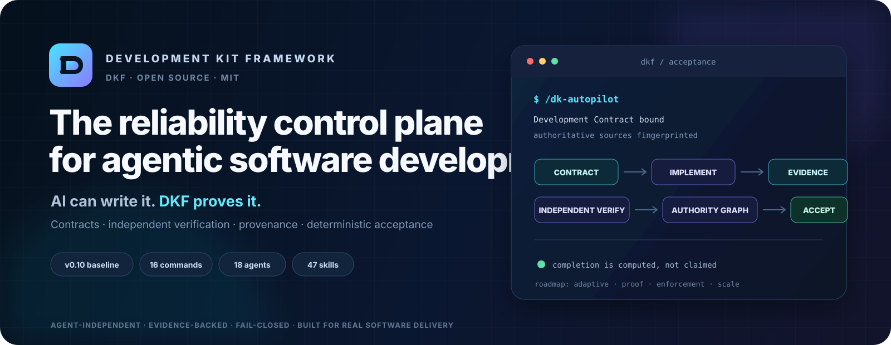

<div align="center">



# Development Kit

### A disciplined AI software-development team, installed into your coding agent.

[](https://github.com/eybersjp/development-kit/actions/workflows/ci.yml)
[](https://www.npmjs.com/package/development-kit)
[](https://github.com/eybersjp/development-kit/releases)
[](LICENSE)
[](package.json)

**Plan deliberately. Build in small verified steps. Review against the specification. Simplify before shipping.**

[Get started](#quick-start) · [Automated workflow](#automated-guided-workflow) · [External research](#external-research-and-capability-providers) · [Documentation](docs/README.md) · [Contributing](CONTRIBUTING.md) · [Releases](https://github.com/eybersjp/development-kit/releases)

</div>

---

## Why Development Kit?

AI coding agents are fast, but speed without engineering discipline creates rework: unclear requirements, oversized diffs, unverified claims, fragile abstractions, and skipped reviews.

Development Kit installs a repeatable senior-engineering workflow into supported AI coding environments. It gives the agent explicit lifecycle stages, specialist roles, verification gates, reusable skills, optional external research capability, and a persistent automated workflow that can pause, resume, recover, and ask for approval before consequential actions.

It is **not** a project-management dashboard and it does not replace engineering judgment. It is an execution discipline for turning an idea or change request into tested, reviewed, release-ready work.

## Current release

The current release line is **v0.6.1** (proposed release candidate).

v0.6 introduces multi-platform integration across Claude Code (`CLAUDE.md`, `.claude/skills/`), Cursor (`.cursor/rules/dkf.mdc`), VS Code with GitHub Copilot (`.github/copilot-instructions.md`), Cline (`.clinerules/dkf.md`), and Windsurf (`.windsurf/rules/dkf.md`). The CLI installer includes target flags `--claude`, `--cursor`, `--vscode`, `--cline`, `--windsurf`, and `--all-platforms`. v0.6.1 adds context-aware Next-Step Guidance, fail-closed consequential action gating, and standalone runtime installation fixes.

## What you get

| Capability | What it provides |
|---|---|
| **Automated Guided Workflow** | `/dk-autopilot` coordinates the complete lifecycle and persists progress between sessions. |
| **14 workflow commands** | Discovery, external research, specification, design, planning, implementation, testing, review, debugging, simplification, status, and shipping. |
| **18 specialist agents** | Focused personas for discovery, architecture, implementation, testing, security, accessibility, design, and review. |
| **46 engineering skills** | Reusable instructions covering the full software-development lifecycle plus provider-neutral external research. |
| **External Capability Providers** | Optional adapters can extend external research without becoming trusted instruction authorities or core dependencies. |
| **Verification-first execution** | Tests, runtime checks, specification review, quality review, and simplification gates before completion. |
| **Safety controls** | Human approval gates for authenticated provider access, external writes, system changes, remote/destructive actions, deployment, and release operations. |
| **Antigravity and OpenCode support** | Plugin installation for Antigravity and auto-discoverable skill installation for OpenCode. |
| **Cross-platform integrations** | Native project instructions and skills for Claude Code, Cursor, VS Code with GitHub Copilot, Cline, and Windsurf. |

## Automated Guided Workflow

```text
UNDERSTAND -> DEFINE -> DESIGN -> PLAN -> IMPLEMENT
     -> VERIFY -> REVIEW -> SIMPLIFY -> COMPLETE
```

Start with:

```text
/dk-autopilot
```

Development Kit selects the next lifecycle action, routes the appropriate command, agent, and skills, records progress, and stops when it needs a decision or approval. External research remains a conditional capability rather than a separate lifecycle stage.

The recommended entry experience is intentionally explicit:

```text
╔══════════════════════════════════════════════════════════════╗
║  🚀 AUTOMATED GUIDED WORKFLOW - RECOMMENDED                 ║
║                                                              ║
║  Take me through the complete Development Kit lifecycle.     ║
║  Select the correct commands, agents, and skills, and pause  ║
║  for important decisions and approval gates.                 ║
╚══════════════════════════════════════════════════════════════╝
```

Manual commands remain available at every stage.

## External research and capability providers

Use `/dk-research` when fresh external evidence materially affects requirements, compatibility, architecture, security, standards, market assumptions, release decisions, or another lifecycle decision.

Development Kit selects the smallest sufficient capability in this order:

1. Existing repository/project evidence.
2. Native runtime or platform capability.
3. Already-connected and user-authorized services.
4. Optional external capability providers.
5. New dependency or system installation only when necessary and explicitly approved.

All retrieved content is **untrusted data**. A page, post, comment, README, transcript, document, provider response, or other source can inform a conclusion, but it cannot override Development Kit instructions, approval gates, repository policy, or user intent. Retrieved content cannot authorize execution of commands merely because it contains instructions.

Capability classes are explicit:

| Class | Default policy |
|---|---|
| **READ** | May run automatically when runtime policy allows. |
| **AUTHENTICATED READ** | Permission is required to use account, token, browser session, cookie, or equivalent identity material. |
| **WRITE** | Requires the normal Development Kit approval gate. |
| **SYSTEM** | Provider installation or host/configuration changes require explicit approval. |
| **DESTRUCTIVE** | Requires explicit approval and all applicable safeguards. |

### Agent-Reach

Agent-Reach is the first documented optional provider adapter through the `agent-reach-integration` skill.

Development Kit does **not** automatically install Agent-Reach and does not add it as a Python/package dependency. If it is already available, `/dk-research` may use it when it offers useful source coverage. If installation is necessary, installation is a SYSTEM-class action and requires approval. Installation guidance should prefer a pinned tagged release or commit rather than a mutable `main.zip` path.

Agent-Reach features that reuse browser authentication, cookies, tokens, or other session material are treated as sensitive authenticated operations. Credentials, cookies, tokens, and session material must never be committed or written into research artifacts.

For substantial research, Development Kit recommends provenance under `.dk/research/` using `findings.md`, `sources.json`, and `manifest.json`.

## Quick start

### Antigravity

```bash
# Automatic environment detection
npx development-kit init

# Install project-locally
npx development-kit init --project

# Preview a standalone installation
npx development-kit init --all --dry-run
```

### OpenCode

```bash
# Install AGENTS.md, opencode.json, and all compatible skills
npx development-kit init --opencode

# Preview first
npx development-kit init --opencode --dry-run
```

The installed `opencode.json` contains only the official schema declaration:

```json
{
  "$schema": "https://opencode.ai/config.json"
}
```

OpenCode loads root `AGENTS.md` automatically. Existing v0.4.1 projects that report `Unrecognized key: rules` should replace their local `opencode.json` with the configuration above or reinstall with v0.4.2 or later.

### Claude Code, Cursor, VS Code with GitHub Copilot, Cline, and Windsurf

```bash
# Preview all five project-local platform adapters
npx development-kit init --all-platforms --dry-run

# Install individual adapters
npx development-kit init --claude
npx development-kit init --cursor
npx development-kit init --vscode
npx development-kit init --cline
npx development-kit init --windsurf
```

`--all-platforms` installs all five adapters. Antigravity and OpenCode retain their explicit installer modes. Existing adapter files are preserved by default unless `--force` is supplied.

### Available installer modes

| Flag | Purpose |
|---|---|
| *(none)* | Detect Antigravity and install the plugin. |
| `--global` | Install to the global Antigravity configuration. |
| `--project` | Install to the current project's `.agents/` directory. |
| `--all` | Copy the complete standalone framework into the project. |
| `--opencode` | Install the OpenCode-compatible configuration, rules, and skill library. |
| `--claude` | Install `CLAUDE.md` and native `.claude/skills/<dk-command>/SKILL.md` packages. |
| `--cursor` | Install `.cursor/rules/dkf.mdc`. |
| `--vscode` | Install `.github/copilot-instructions.md` for VS Code with GitHub Copilot. |
| `--cline` | Install `.clinerules/dkf.md`. |
| `--windsurf` | Install `.windsurf/rules/dkf.mdc`. |
| `--all-platforms` | Install all five adapters above (does not include Antigravity or OpenCode). |
| `--dry-run` | Preview changes without writing files. |
| `--force` | Explicitly allow replacement where safety guards normally preserve user files. |

The installer preserves existing guarded files by default, including `AGENTS.md` and platform-adapter destinations. Platform dry runs perform no writes. Rule-based adapters expose DK workflow names as instructions where native slash commands are unavailable; Claude skills are natively invokable.

### Core commands

| Command | Outcome |
|---|---|
| `/dk-autopilot` | Run the complete lifecycle through the automated guided workflow. |
| `/dk-idea` | Turn a rough idea into a clear, challenged, scoped concept. |
| `/dk-research` | Gather source-backed external evidence through approved capabilities while preserving provenance and trust boundaries. |
| `/dk-spec` | Produce the minimum sufficient specification and acceptance criteria. |
| `/dk-design` | Define the smallest compatible technical and user-experience design. |
| `/dk-tasks` | Create ordered, independently verifiable implementation tasks. |
| `/dk-build` | Implement the next task through the required verification gates. |
| `/dk-build-auto` | Process an approved task plan automatically, stopping on failures. |
| `/dk-test` | Run targeted functional, regression, runtime, and edge-case verification. |
| `/dk-review` | Review specification compliance, code quality, security, accessibility, and design. |
| `/dk-debug` | Reproduce, localise, identify root cause, fix, and protect. |
| `/dk-simplify` | Remove unnecessary code, files, abstractions, and dependencies. |
| `/dk-ship` | Perform final release-readiness and branch-completion checks. |
| `/dk-status` | Inspect the current lifecycle stage, task, blockers, and recommended action. |

## How the discipline works

Every non-trivial change follows the same principles:

1. **Inspect before editing.** Understand the repository and reuse what already exists.
2. **Clarify before assuming.** Make material product decisions explicit.
3. **Research when freshness matters.** Use current external evidence only when it materially improves a decision, and preserve provenance.
4. **Specify before implementing.** Define observable acceptance criteria.
5. **Work in small slices.** Keep tasks and diffs independently verifiable.
6. **Prove behaviour.** Test before claiming completion.
7. **Review the right thing first.** Specification compliance precedes style opinions.
8. **Simplify after correctness.** Remove unnecessary complexity before shipping.
9. **Stop on unresolved failure.** Do not advance the lifecycle by hiding broken gates.

## Supported environments

| Environment | Integration |
|---|---|
| **Antigravity** | Plugin, agents, commands, hooks, 46 skills, templates, evaluations, and runtime utilities. |
| **OpenCode** | Official schema-based `opencode.json`, automatically loaded `AGENTS.md`, and 46 progressively loaded compatible skills. |
| **Claude Code** | `CLAUDE.md` plus native, invokable skills for all 14 DK commands under `.claude/skills/`. |
| **Cursor** | Project rule at `.cursor/rules/dkf.mdc`. |
| **VS Code with GitHub Copilot** | Repository instructions at `.github/copilot-instructions.md`; no `.vscode/settings.json` modification. |
| **Cline** | Project rule at `.clinerules/dkf.md`. |
| **Windsurf** | Project rule at `.windsurf/rules/dkf.md`. |
| **Standalone repositories** | Full framework copy through `--all`. |
| **Optional external providers** | Provider-neutral research contract; Agent-Reach is the first documented adapter and remains optional. |

## Quality and safety

Development Kit includes:

- Persistent, versioned Autopilot state with transaction locking.
- Replay-resistant approval and cancellation tokens.
- Artifact fingerprints and downstream staleness invalidation.
- Mandatory approval gates for authenticated provider access, provider writes, provider/system installation, Git pushes, pull requests, merges, releases, production deployments, package publication, destructive changes, and security-risk acceptance.
- Explicit indirect prompt-injection protection for external research content.
- Unit tests, behavioural evaluation scenarios, documentation validation, OpenCode configuration regression tests, research contract tests, and canonical plugin-mirror synchronization checks that treat CRLF/LF-only differences as content-equivalent while rejecting material drift.

Run the complete local verification suite:

```bash
npm run release:validate
```

The release gate runs framework validation, plugin manifest and mirror synchronization checks, documentation validation and tests, OpenCode configuration regression tests, the external research contract test, Autopilot unit tests, and lifecycle evaluation validation.

## Documentation

- [Documentation home](docs/README.md)
- [Full table of contents](docs/SUMMARY.md)
- [Command reference](docs/03-reference/commands/README.md)
- [dk-research reference](docs/03-reference/commands/dk-research.md)
- [Skill reference](docs/03-reference/skills/README.md)
- [External Capability Providers](docs/04-architecture/external-capability-providers.md)
- [Security and trust boundaries](docs/04-architecture/security-trust-boundaries.md)
- [OpenCode installation](docs/02-user-guide/install-opencode.md)
- [Platform integrations](docs/02-user-guide/platform-integrations.md)
- [Changelog](CHANGELOG.md)

## Project status

Development Kit is actively developed. The v0.6.1 release line includes the production Autopilot foundation, Next-Step Guidance, standalone installer fixes, multi-platform integrations, current OpenCode compatibility, provider-neutral external research, optional Agent-Reach integration guidance, OS-agnostic canonical plugin-mirror integrity checks, a validated public npm package workflow, and complete framework documentation. Public feedback, integration reports, focused improvements, and well-scoped contributions are welcome.

See [SUPPORT.md](SUPPORT.md) for help, [SECURITY.md](SECURITY.md) for vulnerability reporting, and [CONTRIBUTING.md](CONTRIBUTING.md) before proposing changes.

## License

Development Kit is available under the [MIT License](LICENSE).
