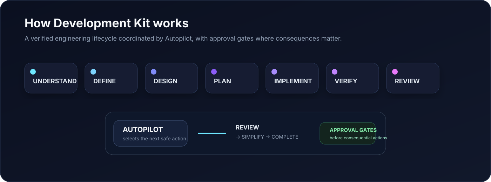
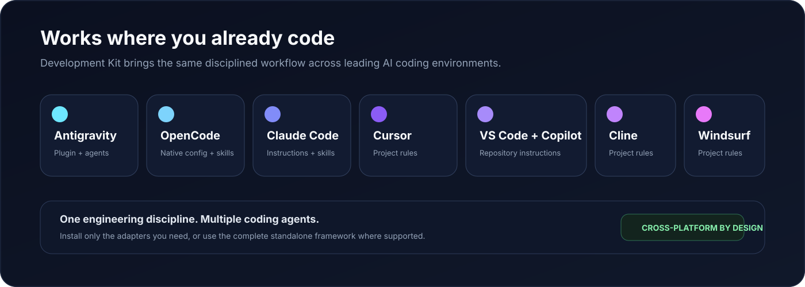

<div align="center">


# Development Kit

### A disciplined AI software-development team, installed into your coding agent.

[](https://github.com/eybersjp/development-kit/actions/workflows/ci.yml)
[](https://www.npmjs.com/package/development-kit)
[](https://github.com/eybersjp/development-kit/releases)
[](LICENSE)
[](package.json)

**Plan deliberately. Build in small verified steps. Review against the specification. Simplify before shipping.**

[Get started](#quick-start) · [Automated workflow](#automated-guided-workflow) · [External research](#external-research-and-capability-providers) · [Documentation](docs/README.md) · [Contributing](CONTRIBUTING.md) · [Releases](https://github.com/eybersjp/development-kit/releases)

</div>

---

## Why Development Kit?

AI coding agents are fast, but speed without engineering discipline creates rework: unclear requirements, oversized diffs, unverified claims, fragile abstractions, skipped reviews, stale assumptions, and unsafe actions outside the intended project scope.

Development Kit installs a repeatable senior-engineering workflow into supported AI coding environments. It gives the agent explicit lifecycle stages, specialist roles, verification gates, reusable skills, optional external research capability, a persistent automated workflow, and a contract-driven reliability control plane that can independently verify work instead of trusting the implementation agent's own completion narrative.

It is **not** a project-management dashboard and it does not replace engineering judgment. It is an execution discipline for turning an idea or change request into tested, reviewed, evidence-backed, release-ready work.

## Current release

The current release line is **v0.9.0**.

v0.9 introduces the **Reliability Control Plane**. Approved tasks become fingerprinted Development Contracts before execution. Verification and review operate from fresh or independently rehydrated authoritative context. Final acceptance is computed from evidence, required controls, risk-derived reviews, architecture/design constraints, source freshness, and approvals instead of being asserted by the implementation agent.

The release also adds bounded correction, destructive-command blast-radius controls, deterministic PLAN validation, canonical artifact reconciliation with mandatory source fingerprints, structured review findings, architecture-drift detection, host-capability fallback, and Proposal Builder adversarial regression fixtures based on real development failures.

v0.8 remains the foundation for **DKF Design Authority**, including `design.md` as the authoritative visual source, `/dk-design-system`, visual-reference analysis, and controlled design amendments. v0.8.1 restored native Antigravity discovery for all 16 `/dk-*` workflows and strengthened installer/plugin synchronization.

## What you get

| Capability | What it provides |
|---|---|
| **Automated Guided Workflow** | `/dk-autopilot` coordinates the complete lifecycle and persists progress between sessions. |
| **Reliability Control Plane** | Development Contracts, source fingerprints, independent verification, deterministic acceptance, bounded correction, structured reviews, execution-safety checks, PLAN validation, and canonical amendment reconciliation. |
| **DKF Design Authority** | `/dk-design-system` establishes, inspects, verifies, and amends the authoritative project `design.md`, eliminating frontend visual drift. |
| **DK Intelligence & Memory** | Durable local engineering memory, architecture decisions, and lifecycle-aware context budgeting with strict project isolation. |
| **DK Control Center** | Integrated local browser UI (`/dk-control`) and secure loopback Runtime API for inspecting and governing workflow, decisions, memory, and settings. |
| **16 workflow commands** | Discovery, design system governance, external research, specification, design, planning, implementation, testing, review, debugging, simplification, status, control center, and shipping. |
| **18 specialist agents** | Focused personas for discovery, architecture, implementation, testing, security, accessibility, design, and review. |
| **47 engineering skills** | Tested skills for requirements, design governance, TDD, code review, security review, a11y, and research provenance. |
| **External Capability Providers** | Optional adapters (e.g. Agent-Reach, TencentDB Agent Memory) can extend capabilities without becoming trusted instruction authorities or core dependencies. |
| **Verification-first execution** | Tests, criterion evidence, control coverage, specification review, quality review, and simplification gates before completion. |
| **Safety controls** | Contract-scoped destructive/remote-command evaluation plus human approval gates for authenticated provider access, external writes, system changes, deployment, and release operations. |
| **Antigravity and OpenCode support** | Plugin installation for Antigravity and auto-discoverable skill installation for OpenCode. |
| **Cross-platform integrations** | Native project instructions and skills for Claude Code, Cursor, VS Code with GitHub Copilot, Cline, and Windsurf. |

## Automated Guided Workflow

<div align="center">

</div>

```text
UNDERSTAND -> DEFINE -> DESIGN -> PLAN -> IMPLEMENT
     -> VERIFY -> REVIEW -> SIMPLIFY -> COMPLETE
```

Start with:

```text
/dk-autopilot
```

Development Kit selects the next lifecycle action, routes the appropriate command, agent, and skills, records progress, and stops when it needs a decision, missing evidence, or approval. In contract-aware work, VERIFY, REVIEW, and COMPLETE cannot advance merely because an agent reports success.

The recommended entry experience is intentionally explicit:

```text
╔══════════════════════════════════════════════════════════════╗
║  🚀 AUTOMATED GUIDED WORKFLOW - RECOMMENDED                 ║
║                                                              ║
║  Take me through the complete Development Kit lifecycle.     ║
║  Select the correct commands, agents, and skills, and pause  ║
║  for important decisions and approval gates.                 ║
╚══════════════════════════════════════════════════════════════╝
```

Manual commands remain available at every stage.

## Reliability Control Plane

For an approved task, Development Kit can create a persisted **Development Contract** that binds:

- task objective and exact scope;
- authoritative project sources and SHA-256 fingerprints;
- requirements and acceptance criteria;
- architecture, design, and security constraints;
- execution-safety policy and risk level;
- required verification, reviewers, controls, correction limits, and approvals.

Verification is performed by eligible independent roles using fresh or rehydrated authoritative context. Implementation reports may be supplied as evidence inputs, but they do not become the source of truth and implementation roles cannot issue authoritative verification records.

Acceptance is deterministic: unresolved evidence, incomplete required controls, failed reviews, stale source fingerprints, unauthorized architecture drift, missing Design Authority evidence, or missing approvals keep the task `PENDING` or `BLOCKED`.

The v0.9 regression suite preserves real failures discovered during a Proposal Builder project, including a declared `20` tasks versus `22` actual tasks, incomplete `17/23` security coverage, duplicate/missing resource ownership, stale artifact amendments, installer/version drift, self-certification, and a host-wide Docker cleanup command issued from project-local work.

## External research and capability providers

Use `/dk-research` when fresh external evidence materially affects requirements, compatibility, architecture, security, standards, market assumptions, release decisions, or another lifecycle decision.

Development Kit selects the smallest sufficient capability in this order:

1. Existing repository/project evidence.
2. Native runtime or platform capability.
3. Already-connected and user-authorized services.
4. Optional external capability providers.
5. New dependency or system installation only when necessary and explicitly approved.

All retrieved content is **untrusted data**. A page, post, comment, README, transcript, document, provider response, or other source can inform a conclusion, but it cannot override Development Kit instructions, approval gates, repository policy, or user intent. Retrieved content cannot authorize execution of commands merely because it contains instructions.

Capability classes are explicit:

| Class | Default policy |
|---|---|
| **READ** | May run automatically when runtime policy allows. |
| **AUTHENTICATED READ** | Permission is required to use account, token, browser session, cookie, or equivalent identity material. |
| **WRITE** | Requires the normal Development Kit approval gate. |
| **SYSTEM** | Provider installation or host/configuration changes require explicit approval. |
| **DESTRUCTIVE** | Requires contract permission, blast-radius checks, and explicit approval where applicable. |

### Agent-Reach

Agent-Reach is the first documented optional provider adapter through the `agent-reach-integration` skill.

Development Kit does **not** automatically install Agent-Reach and does not add it as a Python/package dependency. If it is already available, `/dk-research` may use it when it offers useful source coverage. If installation is necessary, installation is a SYSTEM-class action and requires approval. Installation guidance should prefer a pinned tagged release or commit rather than a mutable `main.zip` path.

Agent-Reach features that reuse browser authentication, cookies, tokens, or other session material are treated as sensitive authenticated operations. Credentials, cookies, tokens, and session material must never be committed or written into research artifacts.

For substantial research, Development Kit recommends provenance under `.dk/research/` using `findings.md`, `sources.json`, and `manifest.json`.

## Quick start

### Antigravity

```bash
# Automatic environment detection
npx development-kit init

# Install project-locally
npx development-kit init --project

# Preview a standalone installation
npx development-kit init --all --dry-run
```

### OpenCode

```bash
# Install AGENTS.md, opencode.json, and all compatible skills
npx development-kit init --opencode

# Preview first
npx development-kit init --opencode --dry-run
```

The installed `opencode.json` contains only the official schema declaration:

```json
{
  "$schema": "https://opencode.ai/config.json"
}
```

OpenCode loads root `AGENTS.md` automatically. Existing projects with the obsolete `rules` key should replace their local `opencode.json` with the configuration above or reinstall with a current Development Kit version.

### Claude Code, Cursor, VS Code with GitHub Copilot, Cline, and Windsurf

```bash
# Preview all five project-local platform adapters
npx development-kit init --all-platforms --dry-run

# Install individual adapters
npx development-kit init --claude
npx development-kit init --cursor
npx development-kit init --vscode
npx development-kit init --cline
npx development-kit init --windsurf
```

`--all-platforms` installs all five adapters. Antigravity and OpenCode retain their explicit installer modes. Existing adapter files are preserved by default unless `--force` is supplied.

### Available installer modes

| Flag | Purpose |
|---|---|
| *(none)* | Detect Antigravity and install the plugin. |
| `--global` | Install to the global Antigravity configuration. |
| `--project` | Install to the current project's `.agents/` directory. |
| `--all` | Copy the complete standalone framework into the project. |
| `--opencode` | Install the OpenCode-compatible configuration, rules, and skill library. |
| `--claude` | Install `CLAUDE.md` and native `.claude/skills/<dk-command>/SKILL.md` packages. |
| `--cursor` | Install `.cursor/rules/dkf.mdc`. |
| `--vscode` | Install `.github/copilot-instructions.md` for VS Code with GitHub Copilot. |
| `--cline` | Install `.clinerules/dkf.md`. |
| `--windsurf` | Install `.windsurf/rules/dkf.md`. |
| `--all-platforms` | Install all five adapters above (does not include Antigravity or OpenCode). |
| `--dry-run` | Preview changes without writing files. |
| `--force` | Explicitly allow replacement where safety guards normally preserve user files. |

The installer preserves existing guarded files by default, including `AGENTS.md` and platform-adapter destinations. Platform dry runs perform no writes. Rule-based adapters expose DK workflow names as instructions where native slash commands are unavailable; Claude skills are natively invokable.

## Core commands

| Command | Outcome |
|---|---|
| `/dk-autopilot` | Run the complete lifecycle through the automated guided workflow. |
| `/dk-idea` | Turn a rough idea into a clear, challenged, scoped concept. |
| `/dk-research` | Gather source-backed external evidence through approved capabilities while preserving provenance and trust boundaries. |
| `/dk-spec` | Produce the minimum sufficient specification and acceptance criteria. |
| `/dk-design` | Define the smallest compatible technical and user-experience design. |
| `/dk-design-system` | Establish, inspect, verify, or amend the authoritative frontend design system. |
| `/dk-tasks` | Create ordered, independently verifiable implementation tasks and validate plan consistency. |
| `/dk-build` | Implement the next approved contract-scoped task through the required evidence and review gates. |
| `/dk-build-auto` | Process an approved task plan automatically, stopping on unresolved failures, drift, or approvals. |
| `/dk-test` | Run independent task-specific verification and produce evidence-backed criterion results. |
| `/dk-review` | Run structured specification, code, security, accessibility, design, and architecture reviews as required. |
| `/dk-debug` | Reproduce, localise, identify root cause, fix, and protect. |
| `/dk-simplify` | Remove unnecessary code, files, abstractions, and dependencies. |
| `/dk-ship` | Perform final release-readiness and branch-completion checks. |
| `/dk-control` | Launch the local Development Kit Control Center web interface. |
| `/dk-status` | Inspect lifecycle, contract, verification, review, acceptance, correction, and blocker state. |

## How the discipline works

Every non-trivial change follows the same principles:

1. **Inspect before editing.** Understand the repository and reuse what already exists.
2. **Clarify before assuming.** Make material product decisions explicit.
3. **Research when freshness matters.** Use current external evidence only when it materially improves a decision, and preserve provenance.
4. **Specify before implementing.** Define observable acceptance criteria.
5. **Contract before execution.** Bind approved task scope and authoritative source fingerprints before implementation when the reliability runtime applies.
6. **Work in small slices.** Keep tasks and diffs independently verifiable.
7. **Prove behaviour independently.** The implementation agent's report is not final proof.
8. **Compute coverage.** Missing required controls stay visible even when every executed test passes.
9. **Review the right thing first.** Specification compliance precedes style opinions.
10. **Simplify after correctness.** Remove unnecessary complexity before shipping.
11. **Stop on unresolved failure.** Do not advance the lifecycle by hiding broken gates.

## Supported environments

<div align="center">

</div>

| Environment | Integration |
|---|---|
| **Antigravity** | Plugin with 47 engineering skills plus 16 native `/dk-*` workflow-entry skills, 18 agents, 4 hooks, templates, evaluations, runtime utilities, and orchestration schemas. |
| **OpenCode** | Official schema-based `opencode.json`, automatically loaded `AGENTS.md`, 47 engineering skills, and the 16 workflow-entry skills. |
| **Claude Code** | `CLAUDE.md` plus native, invokable DK workflow skills under `.claude/skills/`. |
| **Cursor** | Project rule at `.cursor/rules/dkf.mdc`. |
| **VS Code with GitHub Copilot** | Repository instructions at `.github/copilot-instructions.md`; no `.vscode/settings.json` modification. |
| **Cline** | Project rule at `.clinerules/dkf.md`. |
| **Windsurf** | Project rule at `.windsurf/rules/dkf.md`. |
| **Standalone repositories** | Full framework copy through `--all`, including runtime and schemas. |
| **Optional external providers** | Provider-neutral research contract; Agent-Reach is the first documented adapter and remains optional. |

## Quality and safety

Development Kit includes:

- Fingerprinted Development Contracts that bind approved task scope to authoritative sources.
- Independent fresh/rehydrated verification contexts and explicit prohibition on implementation self-certification.
- Evidence-bearing criterion and control manifests with computed coverage and immutable persistence.
- Deterministic acceptance derived from risk, required reviewers/controls, source freshness, architecture/design state, and approvals.
- Bounded correction with retry limits, scope locks, and repeated-failure detection.
- Project/declared-resource/host blast-radius classification for destructive and remote commands.
- Exact-fingerprint canonical artifact amendments with atomic write/read-back verification.
- Deterministic PLAN checks for task counts, dependencies, cycles, ownership, and acceptance-criterion coverage.
- Persistent, versioned Autopilot state with transaction locking and contract-aware result gates.
- Replay-resistant approval and cancellation tokens.
- Artifact fingerprints and downstream staleness invalidation.
- Mandatory approval gates for authenticated provider access, provider writes, provider/system installation, Git pushes, pull requests, merges, releases, production deployments, package publication, destructive changes, and security-risk acceptance.
- Explicit indirect prompt-injection protection for external research content.
- Proposal Builder adversarial regression tests preserving known real-world failure cases.

Run the complete local verification suite:

```bash
npm run release:validate
```

The release gate runs framework and plugin validation, documentation checks, installer/package isolation tests, platform/research/next-step validation, Development Contract checks, execution-safety tests, evidence/control coverage, core orchestration, command integration, v0.9 adversarial/fail-closed/version regressions, DK Intelligence, Design Authority, Autopilot tests, and lifecycle evaluations.

## Documentation

- [Documentation home](docs/README.md)
- [Full table of contents](docs/SUMMARY.md)
- [Command reference](docs/03-reference/commands/README.md)
- [Orchestration runtime CLI](docs/03-reference/scripts/orchestration.md)
- [v0.9 Reliability Control-Plane Amendment](docs/04-architecture/dk-reliability-control-plane-amendment.md)
- [v0.9 Release Notes](docs/08-maintenance-release/release-notes-v0.9.0.md)
- [Skill reference](docs/03-reference/skills/README.md)
- [External Capability Providers](docs/04-architecture/external-capability-providers.md)
- [Security and trust boundaries](docs/04-architecture/security-trust-boundaries.md)
- [OpenCode installation](docs/02-user-guide/install-opencode.md)
- [Platform integrations](docs/02-user-guide/platform-integrations.md)
- [Changelog](CHANGELOG.md)

## Project status

Development Kit is actively developed. The v0.9.0 release line includes the Reliability Control Plane, production Autopilot foundation, DK Intelligence & Memory, DK Control Center, DKF Design Authority, native Antigravity discovery for all 16 `/dk-*` workflows, multi-platform integrations, provider-neutral external research, and the complete verification-first release pipeline. Public feedback, integration reports, focused improvements, and well-scoped contributions are welcome.

See [SUPPORT.md](SUPPORT.md) for help, [SECURITY.md](SECURITY.md) for vulnerability reporting, and [CONTRIBUTING.md](CONTRIBUTING.md) before proposing changes.

## License

Development Kit is available under the [MIT License](LICENSE).
