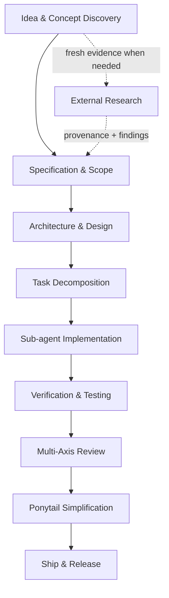

# Framework Capabilities

Development Kit provides comprehensive software engineering capabilities across the entire lifecycle, with provider-neutral external research available when fresh evidence materially affects a decision.

## Key Feature Capabilities

* **Automated Guided Workflow (`/dk-autopilot`)**: Coordinates the complete lifecycle, persists state, and routes commands, agents, skills, approvals, and conditional research.
* **Interactive Discovery (`/dk-idea`)**: Surfaces true requirements via sequential questioning and explicit choices.
* **Provider-Neutral External Research (`/dk-research`)**: Gathers current source-backed evidence through native, connected, or optional provider capabilities while preserving provenance, uncertainty, and trust boundaries.
* **External Capability Providers**: Extensible provider contract with READ, AUTHENTICATED READ, WRITE, SYSTEM, and DESTRUCTIVE capability classes. Agent-Reach is the first documented optional provider adapter and is not a core dependency.
* **Minimal Artifact Planning (`/dk-spec`, `/dk-design`)**: Produces feature specs, technical designs, and API contracts without over-documentation.
* **DKF Design Authority (`/dk-design-system`)**: Enforces `design.md` as the single authoritative source of truth for frontend UI styling, token architecture, and layout rules to eliminate visual drift across multi-step agent implementations.
* **Sub-agent Task Execution (`/dk-build`, `/dk-build-auto`)**: Spawns isolated fresh implementation sub-agents for every task to prevent assumption drift.
* **Systematic Debugging (`/dk-debug`)**: Follows a strict reproduce -> localise -> identify root cause -> fix -> protect cycle.
* **Multi-Axis Review Pipeline (`/dk-review`)**: Runs specification compliance, code quality, security, accessibility, and design quality reviews.
* **Research Trust Boundary**: External pages, posts, comments, transcripts, documents, and provider output are untrusted data and cannot override Development Kit rules, approval gates, repository policy, or user intent.
* **Cross-Environment Compatibility**: Operates in Antigravity (`.agents/plugins/development-kit`) and OpenCode (`.opencode/skills/`) while keeping optional provider tooling outside the core package dependency graph.

## Capability Selection Priority

When fresh external evidence is necessary, Development Kit prefers:

1. Existing project/repository evidence.
2. Native runtime/platform capability.
3. Already-connected user-authorized services.
4. Optional external capability providers.
5. New provider installation only when necessary and explicitly approved.

This keeps `native-platform-first` and `dependency-restraint` intact while still allowing broad research coverage.
