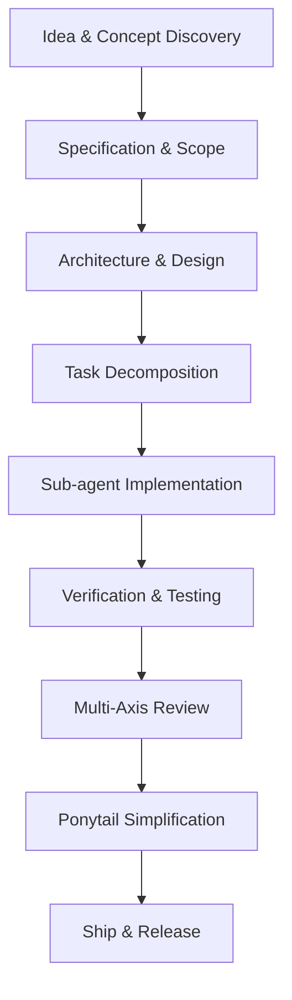

# Framework Capabilities

Development Kit provides comprehensive software engineering capabilities across the entire lifecycle:

## Key Feature Capabilities

* **Interactive Discovery (`/dk-idea`)**: Surfaces true requirements via sequential questioning and numbered option choices.
* **Minimal Artifact Planning (`/dk-spec`, `/dk-design`)**: Produces feature specs, technical designs, and API contracts without over-documentation.
* **Sub-agent Task Execution (`/dk-build`, `/dk-build-auto`)**: Spawns isolated fresh implementation sub-agents for every task to prevent assumption drift.
* **Systematic Debugging (`/dk-debug`)**: Follows a strict reproduce → localise → identify root cause → fix → protect cycle.
* **Multi-Axis Review Pipeline (`/dk-review`)**: Runs specification compliance, code quality, security, accessibility, and design quality reviews.
* **Cross-Environment Compatibility**: Operates seamlessly in Antigravity (`.agents/plugins/development-kit`) and OpenCode (`.opencode/skills/`).
