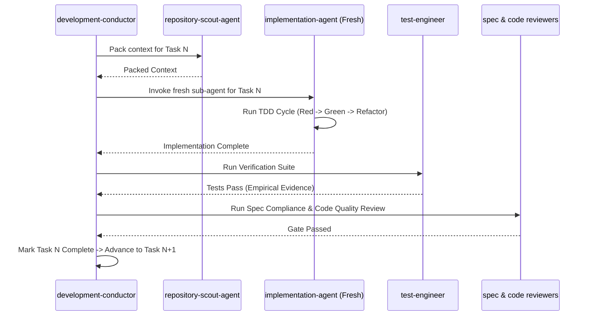

# Mandatory Task Loop

The **Mandatory Task Loop** is the core operational engine executed during the `IMPLEMENT` stage (`/dk-build` or `/dk-build-auto`).

## Mandatory Task Rules

1. **Sub-agent Isolation**: Every task MUST be executed by a fresh sub-agent (`implementation-agent`, `frontend-implementer`, `backend-implementer`, or `database-implementer`).
2. **Sequential Gating**: Never begin Task N+1 while Task N has unresolved test failures or open review findings.
3. **Empirical Proof**: A task is NOT complete when an implementation sub-agent claims it is complete. Proof requires clean execution of verification commands (`npm run validate`, `npm test`, etc.).
