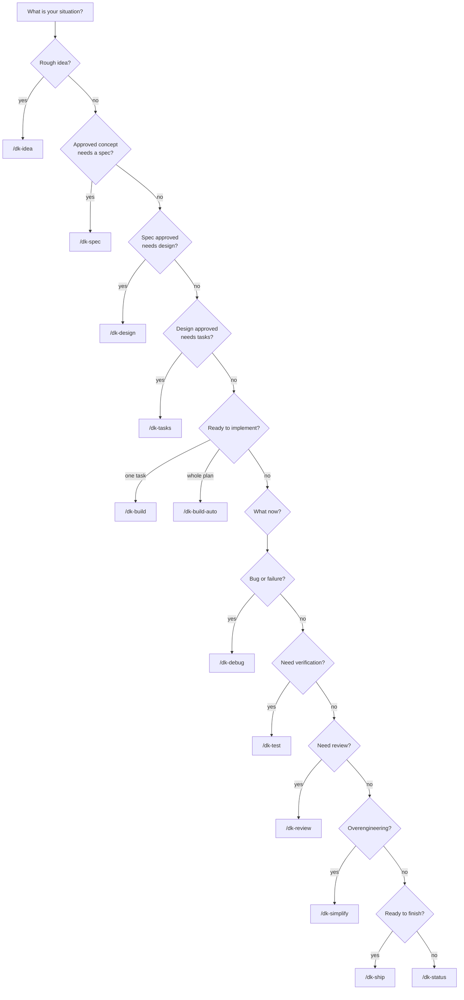

# Choosing the Correct Command

## Decision Tree

## Situation → Command

| Situation | Command |
| :--- | :--- |
| Rough idea, problem statement | `/dk-idea` |
| Defined feature (spec required) | `/dk-spec` |
| Approved specification | `/dk-design` |
| Implementation plan required | `/dk-tasks` |
| Implement the next task | `/dk-build` |
| Run the whole approved plan automatically | `/dk-build-auto` |
| Bug / failing test / failure | `/dk-debug` |
| Run verification (browser, regression, edge cases) | `/dk-test` |
| Code review / full review cycle | `/dk-review` |
| Security review focus | `/dk-review` (security-reviewer activates conditionally) |
| Simplification | `/dk-simplify` |
| Release preparation | `/dk-ship` |
| "Where am I?" / workflow status | `/dk-status` |

## Rules of Thumb

1. **Never implement before defining.** If no spec exists, `/dk-build` is premature — start earlier in the lifecycle.
2. **Bugs go to `/dk-debug`**, not `/dk-build` — debugging uses the reproduce → locate → fix → protect cycle.
3. **`/dk-review` reviews the current diff**, it does not implement.
4. **`/dk-status` is always safe** — use it whenever you are unsure where the workflow stands.

## Also See

- [command-selection-matrix.md](../03-reference/commands/command-selection-matrix.md) — full reference matrix
- [command-workflow-recipes.md](command-workflow-recipes.md) — combined sequences
- [workflow-sequences.md](../03-reference/commands/workflow-sequences.md) — normal, abbreviated, recovery, and full-project sequences
