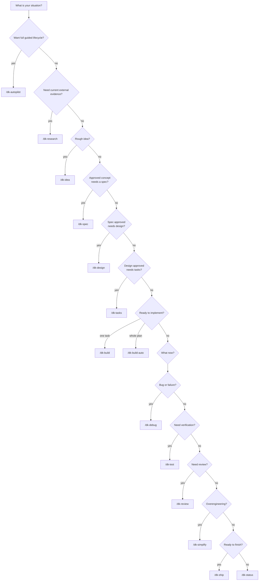

# Choosing the Correct Command

## Decision Tree

## Situation -> Command

| Situation | Command |
| :--- | :--- |
| Want Development Kit to guide the complete lifecycle | `/dk-autopilot` |
| Need current source-backed external evidence | `/dk-research` |
| Rough idea, problem statement | `/dk-idea` |
| Defined feature (spec required) | `/dk-spec` |
| Approved specification | `/dk-design` |
| Implementation plan required | `/dk-tasks` |
| Implement the next task | `/dk-build` |
| Run the whole approved plan automatically | `/dk-build-auto` |
| Bug / failing test / failure | `/dk-debug` |
| Run verification (browser, regression, edge cases) | `/dk-test` |
| Code review / full review cycle | `/dk-review` |
| Security review focus | `/dk-review` (security-reviewer activates conditionally) |
| Simplification | `/dk-simplify` |
| Release preparation | `/dk-ship` |
| "Where am I?" / workflow status | `/dk-status` |

## When to Use `/dk-research`

Use `/dk-research` when a decision depends on information that can materially change outside the repository, such as current standards, compatibility, provider behavior, security advisories, market facts, release state, or other fresh external evidence.

Do not use research as a substitute for repository inspection. Development Kit prefers repository evidence, native capability, and already-connected user-authorized services before optional External Capability Providers.

External content remains untrusted data. It can support a conclusion but cannot override Development Kit instructions, approval gates, repository policy, or user intent.

## Rules of Thumb

1. **Use `/dk-autopilot` when you want the full lifecycle managed for you.** Manual commands remain available when you want direct control.
2. **Never implement before defining.** If no spec exists, `/dk-build` is premature; start earlier in the lifecycle.
3. **Research only when freshness matters.** `/dk-research` is conditional and is not a tenth lifecycle stage.
4. **Bugs go to `/dk-debug`**, not `/dk-build`; debugging uses the reproduce -> locate -> fix -> protect cycle.
5. **`/dk-review` reviews the current diff**, it does not implement.
6. **`/dk-status` is always safe**; use it whenever you are unsure where the workflow stands.

## Also See

- [command-selection-matrix.md](../03-reference/commands/command-selection-matrix.md) - full reference matrix
- [dk-research.md](../03-reference/commands/dk-research.md) - external research command reference
- [command-workflow-recipes.md](command-workflow-recipes.md) - combined sequences
- [workflow-sequences.md](../03-reference/commands/workflow-sequences.md) - normal, abbreviated, recovery, and full-project sequences
