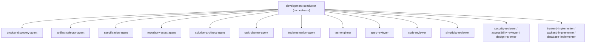

# Agents Index

Development Kit defines 18 specialist agents. The **development-conductor** orchestrates them; implementation agents are spawned **fresh per task**.

## Overview

## All Agents

| Agent | Type | Reference |
| :--- | :--- | :--- |
| **development-conductor** | Orchestrator | [development-conductor.md](development-conductor.md) |
| **repository-scout-agent** | Context gatherer | [repository-scout-agent.md](repository-scout-agent.md) |
| **product-discovery-agent** | Discovery | [product-discovery-agent.md](product-discovery-agent.md) |
| **artifact-selector-agent** | Definition | [artifact-selector-agent.md](artifact-selector-agent.md) |
| **specification-agent** | Definition | [specification-agent.md](specification-agent.md) |
| **solution-architect-agent** | Design | [solution-architect-agent.md](solution-architect-agent.md) |
| **task-planner-agent** | Planning | [task-planner-agent.md](task-planner-agent.md) |
| **implementation-agent** | Implementation (fresh) | [implementation-agent.md](implementation-agent.md) |
| **frontend-implementer** | Implementation (fresh, UI) | [frontend-implementer.md](frontend-implementer.md) |
| **backend-implementer** | Implementation (fresh, backend) | [backend-implementer.md](backend-implementer.md) |
| **database-implementer** | Implementation (fresh, database) | [database-implementer.md](database-implementer.md) |
| **test-engineer** | Verification | [test-engineer.md](test-engineer.md) |
| **spec-reviewer** | Review — gate 1 (spec compliance) | [spec-reviewer.md](spec-reviewer.md) |
| **code-reviewer** | Review — gate 2 (code quality) | [code-reviewer.md](code-reviewer.md) |
| **security-reviewer** | Review — conditional (security) | [security-reviewer.md](security-reviewer.md) |
| **accessibility-reviewer** | Review — conditional (WCAG AA) | [accessibility-reviewer.md](accessibility-reviewer.md) |
| **design-reviewer** | Review — conditional (visual quality) | [design-reviewer.md](design-reviewer.md) |
| **simplicity-reviewer** | Review — final gate (simplicity) | [simplicity-reviewer.md](simplicity-reviewer.md) |

## Matrices & Diagrams

- [Agent Responsibility Matrix](agent-responsibility-matrix.md) — responsibility, stage, invocation model per agent
- [Agent Handoff Map](agent-handoff-map.md) — orchestration, task flow, fresh-agent isolation, review order

## Key Rules

- The conductor **never implements code itself**.
- Every implementation task uses a **fresh sub-agent**.
- Review order is fixed: spec compliance → code quality → conditional reviews → simplicity.
- Tasks are **sequential** — the next task never starts while the current task has unresolved failures.
