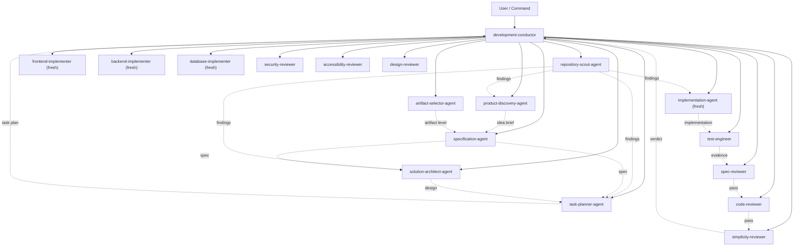
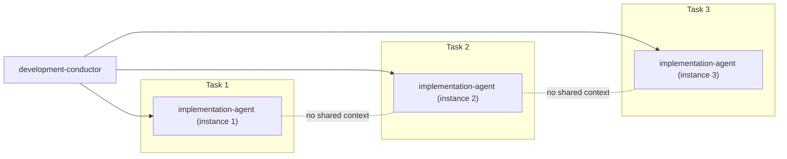
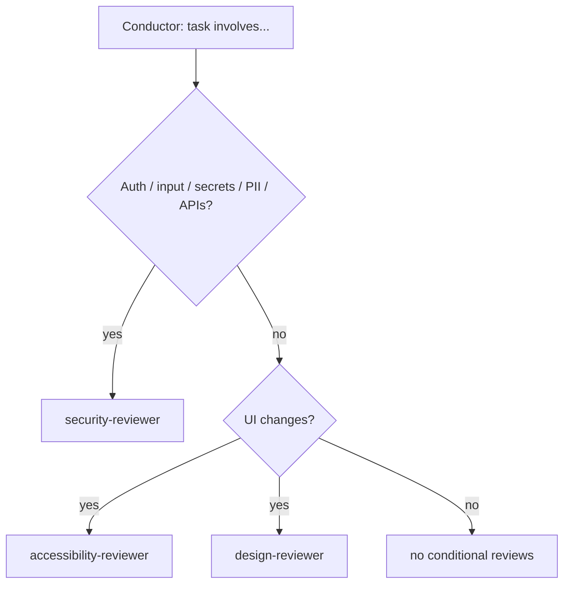

# Agent Handoff Map

## Orchestration Overview

The development-conductor is the single coordinator. Every specialist agent is spawned by the conductor and reports back to it. Specialist agents do not spawn each other.



## Sequential Task Flow (per task in `/dk-build`)

```mermaid
sequenceDiagram
    participant C as Conductor
    participant S as Repository Scout
    participant R as Readiness Check
    participant I as Implementation Agent (fresh)
    participant T as Test Engineer
    participant SR as Spec Reviewer
    participant CR as Code Reviewer
    participant SIM as Simplicity Reviewer
    C->>S: inspect task area
    S-->>C: scout report
    C->>R: validate task readiness
    R-->>C: ready / issues
    C->>I: task package (fresh instance)
    I-->>C: implementation + local tests
    C->>T: verify + edge cases
    T-->>C: test report
    C->>SR: gate 1 (spec compliance)
    SR-->>C: verdict
    C->>CR: gate 2 (code quality)
    CR-->>C: verdict
    C->>SIM: final gate (simplicity)
    SIM-->>C: verdict
    C->>T: re-run tests after simplification
    T-->>C: green
    Note over C: task complete; next task may begin
```

## Fresh Implementation-Agent Isolation



Each task gets a **fresh** implementation instance with a self-contained context package. No long-running agent accumulates assumptions across tasks.

## Conditional Reviewer Selection



## Review Order (never reordered)

**spec-compliance → code-quality → conditional reviews → simplicity → re-verify.**

See [agent-responsibility-matrix.md](agent-responsibility-matrix.md) and [command-agent-skill-matrix.md](../../11-appendices/command-agent-skill-matrix.md).
