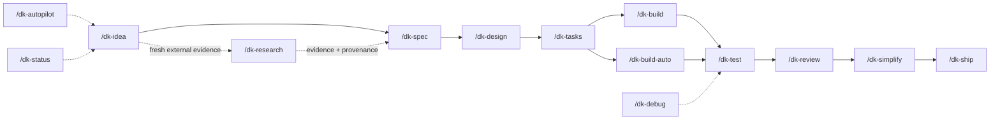

# Commands Index

Development Kit provides 14 slash commands covering the full software development lifecycle plus provider-neutral external research and workflow status/recovery operations.

## All Commands

| Command | Lifecycle Stage | Description |
| :--- | :--- | :--- |
| [`/dk-autopilot`](dk-autopilot.md) | Full lifecycle | Runs the complete Automated Guided Workflow |
| [`/dk-idea`](dk-idea.md) | UNDERSTAND | Refine a rough idea into a concrete concept |
| [`/dk-research`](dk-research.md) | Conditional / any stage | Gather current external evidence through approved capabilities with provenance and trust boundaries |
| [`/dk-spec`](dk-spec.md) | DEFINE | Create the minimum required specification artifacts |
| [`/dk-design`](dk-design.md) | DESIGN | Produce technical and visual design |
| [`/dk-tasks`](dk-tasks.md) | PLAN | Break approved work into small, verifiable tasks |
| [`/dk-build`](dk-build.md) | IMPLEMENT | Implement the next task through every gate |
| [`/dk-build-auto`](dk-build-auto.md) | IMPLEMENT | Process the entire plan automatically |
| [`/dk-test`](dk-test.md) | VERIFY | Run task-specific verification |
| [`/dk-review`](dk-review.md) | REVIEW | Run the full multi-axis review cycle |
| [`/dk-simplify`](dk-simplify.md) | SIMPLIFY | Apply the Ponytail simplicity ladder |
| [`/dk-debug`](dk-debug.md) | Recovery | Systematic root-cause analysis |
| [`/dk-ship`](dk-ship.md) | COMPLETE | Final verification and release preparation |
| [`/dk-status`](dk-status.md) | Anytime | Show current workflow state |

## Quick Decision Guide

- **Want the framework to guide the entire lifecycle?** -> `/dk-autopilot`
- **Have a rough idea?** -> `/dk-idea`
- **Need current external facts, standards, compatibility information, or source-backed evidence?** -> `/dk-research`
- **Need to debug something?** -> `/dk-debug`
- **Ready to release?** -> `/dk-ship`
- **Not sure where you are?** -> `/dk-status`

`/dk-research` is a conditional capability, not a new lifecycle stage. External content is treated as untrusted data and cannot override Development Kit instructions or approvals.

See the [Command Selection Matrix](command-selection-matrix.md) for a complete decision table.
