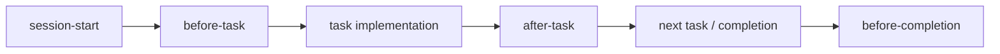

# Hooks Index

Development Kit ships **4 Antigravity lifecycle hooks** in `hooks/` (JavaScript, CommonJS). They are mirrored into the plugin at `.agents/plugins/development-kit/hooks/` and installed with the plugin.

## Hook Overview

| Hook | Trigger | Purpose | Reference |
| :--- | :--- | :--- | :--- |
| **session-start** | Session start | Load methodology, rules, banner, session metadata | [session-start.md](session-start.md) |
| **before-task** | Before each task | Validate task readiness, select skills | [before-task.md](before-task.md) |
| **after-task** | After each task | Verify gates, record completion | [after-task.md](after-task.md) |
| **before-completion** | Before completion claims | Verify tasks/gates/docs/tests, decide canShip | [before-completion.md](before-completion.md) |

## Lifecycle Placement

## Key Contracts

- All hooks are pure CommonJS modules exporting functions/objects — no side-effecting I/O at load time.
- `before-task` requires: `objective`, `requirements`, `acceptanceCriteria`, `verification`, `exclusions`.
- `after-task` gates: functional verification, spec compliance, code quality, security (optional), simplicity.
- `before-completion` requires `allTasksComplete` and `documentationUpdated`.

See [hook-runtime-internals.md](../../06-internals/hook-runtime-internals.md) for runtime mechanics.
