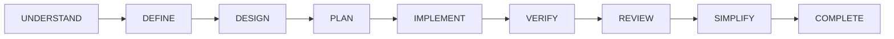
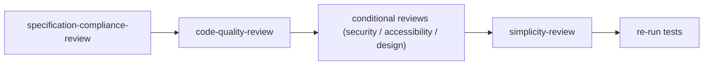

# Lifecycle to Skill Map

Which skills are active at each lifecycle stage.

## Stage Map

| Stage | Active Skills | Command |
| :--- | :--- | :--- |
| **UNDERSTAND** | repository-orientation, idea-discovery, requirements-interview, idea-challenge, scope-definition | `/dk-idea` |
| **DEFINE** | adaptive-artifact-planning, feature-specification, acceptance-criteria-writing | `/dk-spec` |
| **DESIGN** | technical-design, data-model-design, api-contract-design, user-flow-design, design-direction | `/dk-design` |
| **PLAN** | task-decomposition, subtask-decomposition, dependency-ordering, risk-first-planning, task-readiness-check, test-strategy | `/dk-tasks` |
| **IMPLEMENT** | subagent-driven-implementation, incremental-implementation, test-driven-development, existing-code-first, native-platform-first, dependency-restraint, minimal-diff, context-packing | `/dk-build`, `/dk-build-auto` |
| **VERIFY** | verification-before-completion, browser-runtime-verification, regression-testing, edge-case-testing, systematic-debugging (recovery) | `/dk-test`, `/dk-debug` |
| **REVIEW** | specification-compliance-review, code-quality-review, security-review, accessibility-review, design-quality-review | `/dk-review` |
| **SIMPLIFY** | simplicity-review | `/dk-simplify` |
| **COMPLETE** | task-completion-gate, branch-completion, release-readiness | `/dk-ship` |

## Always-Active Skills

- `using-development-kit` — loaded at session start
- `skill-routing` — used for every request classification (and `/dk-status`)

## Review Sequence Within a Task

See [skill-routing-matrix.md](skill-routing-matrix.md) for request→skill routing and the [lifecycle-responsibility-matrix.md](../../11-appendices/lifecycle-responsibility-matrix.md) for full responsibility coverage.
