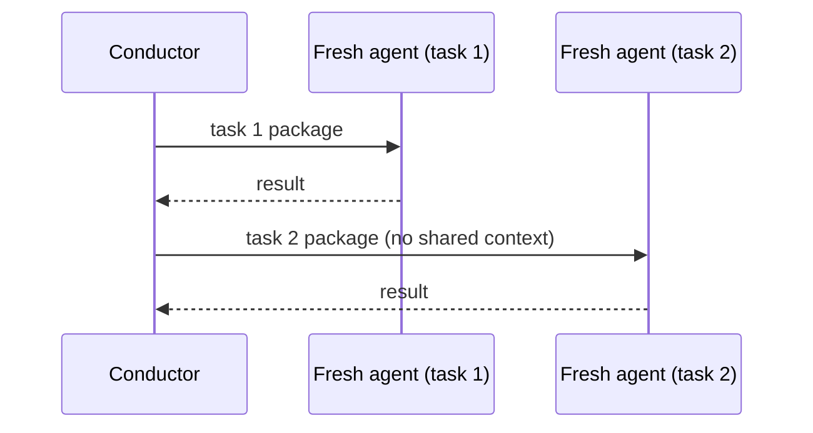
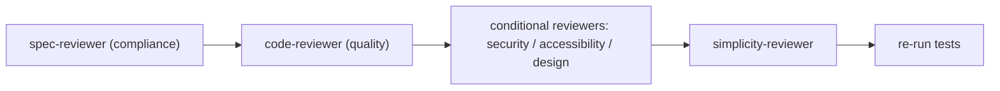

# Agent Orchestration

## Coordination Model

The development-conductor is the **single coordinator**. All specialist agents are spawned by it and report to it; specialists never spawn each other.

```mermaid
graph TD
    C["development-conductor"]
    C -->|context| S["repository-scout-agent"]
    C -->|discovery| P["product-discovery-agent"]
    C -->|artifacts| A["artifact-selector-agent"]
    C -->|spec| SP["specification-agent"]
    C -->|design| ARC["solution-architect-agent"]
    C -->|plan| T["task-planner-agent"]
    C -->|task package| I["implementation-agent (fresh)"]
    C -->|UI task| FE["frontend-implementer (fresh)"]
    C -->|backend task| BE["backend-implementer (fresh)"]
    C -->|db task| DB["database-implementer (fresh)"]
    C -->|verify| TE["test-engineer"]
    C -->|gate 1| SR["spec-reviewer"]
    C -->|gate 2| CR["code-reviewer"]
    C -->|conditional| SEC["security-reviewer"]
    C -->|conditional| ACC["accessibility-reviewer"]
    C -->|conditional| DR["design-reviewer"]
    C -->|final gate| SIM["simplicity-reviewer"]
```

## Fresh Sub-Agent Isolation

- Every implementation task uses a **fresh** agent instance with a self-contained context package.
- No long-running implementation agent accumulates assumptions across tasks.
- This is the mechanism that prevents assumption drift (rule 7 of the always-on rules).

## Review Sequence

Fixed order, never reordered:

## Escalation Paths

- **Test failure** → conductor routes to test-engineer + implementation-agent
- **Critical review finding** → conductor stops and routes back to implementation
- **Task blocker** → conductor surfaces to the user

See [agent-handoff-map.md](../03-reference/agents/agent-handoff-map.md) and [implementation-agent-isolation.md](../06-internals/implementation-agent-isolation.md).
