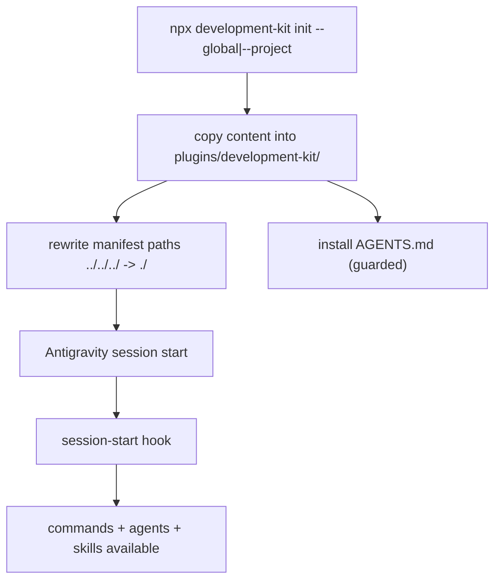

# Antigravity Integration

## Plugin Model

Development Kit is an Antigravity **plugin**: a self-contained directory with a manifest, skills, agents, hooks, and commands, installed into a config directory.

```text
~/.gemini/config/                    # global install target
└── plugins/development-kit/
    ├── plugin.json                  # manifest (./ paths after rewrite)
    ├── skills/  (63)
    ├── agents/  (18)
    ├── hooks/   (4)
    └── commands/ (16)
```

## Install Modes

| Mode | Target | When |
| :--- | :--- | :--- |
| `--global` | `~/.gemini/config/plugins/development-kit/` | Use in any project on the machine |
| `--project` | `./.agents/plugins/development-kit/` | Use in one project |
| auto-detect | first found of `~/.gemini/config`, `./.agents`, `./.gemini` | Default behaviour |

## Discovery

Antigravity discovers the plugin via `plugin.json` in the plugins directory. The manifest lists skills, agents, and hooks with relative paths (rewritten to `./` by the installer so they resolve inside the installed plugin). All 16 commands also have native Antigravity skill adapters under `skills/dk-*` ensuring complete command discovery.

## Hooks

Four lifecycle hooks run at session/task/completion boundaries (`session-start`, `before-task`, `after-task`, `before-completion`) — see [hook-runtime-internals.md](../06-internals/hook-runtime-internals.md).

## Commands

The 16 `/dk-*` commands are installed as command definitions and native skill adapters; each routes through the conductor.

## Flow



See [install-antigravity-global.md](../02-user-guide/install-antigravity-global.md), [install-antigravity-project.md](../02-user-guide/install-antigravity-project.md), and [antigravity-workflow.md](../10-examples/antigravity-workflow.md).
