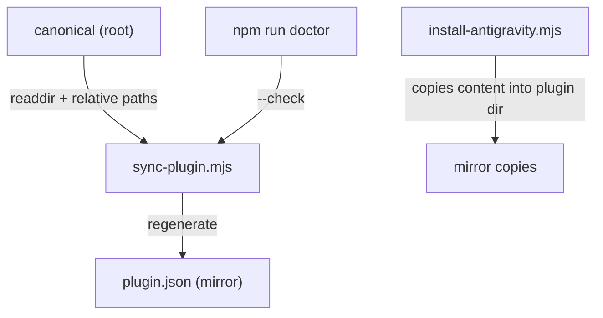

# Canonical Source & Plugin Mirror

## The Two Locations

The repository maintains **canonical source** at the root and a **mirror** under `.agents/plugins/development-kit/`:

| Content | Canonical | Mirror |
| :--- | :--- | :--- |
| `skills/` | `skills/<name>/SKILL.md` | `.agents/plugins/development-kit/skills/<name>/SKILL.md` |
| `agents/` | `agents/<name>.md` | `.agents/plugins/development-kit/agents/<name>.md` |
| `commands/` | `commands/<name>.md` | `.agents/plugins/development-kit/commands/<name>.md` |
| `hooks/` | `hooks/<name>.js` | `.agents/plugins/development-kit/hooks/<name>.js` |

**Verified state**: the mirror files are byte-identical to canonical (`diff -rq` reports no differences).

## Synchronisation Mechanism

- `sync-plugin.mjs` regenerates `plugin.json` from the canonical directories; it does **not** copy content files.
- The mirror content copies are produced by `install-antigravity.mjs` when it installs the plugin into a target (including the repo's own `.agents/`).
- Contributors must **edit canonical only**; the mirror is refreshed by the scripts.

## Rules

1. **Never edit mirror files directly.**
2. Run `node scripts/sync-plugin.mjs` (or `--fix`) after adding/removing skills, agents, or hooks.
3. Run `npm run doctor` to check for drift between directories and the manifest.
4. Documentation and validation treat canonical and mirror as **one component** — never double-count.

## Known Drift

The committed `plugin.json` currently uses `./` path prefixes while the generator produces `../../../` prefixes, so `--check` reports all components as "missing". Regenerating the manifest restores the canonical form. See [known-limitations.md](../11-appendices/known-limitations.md).

See [source-of-truth-map.md](../00-documentation/source-of-truth-map.md) and [plugin-sync-internals.md](../06-internals/plugin-sync-internals.md).
