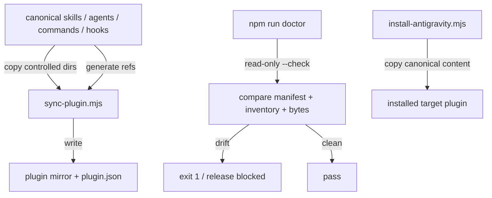

# Canonical Source & Plugin Mirror

## The Two Locations

The repository maintains **canonical source** at the root and a committed **mirror** under `.agents/plugins/development-kit/`:

| Content | Canonical | Mirror |
| :--- | :--- | :--- |
| `skills/` | `skills/<name>/SKILL.md` | `.agents/plugins/development-kit/skills/<name>/SKILL.md` |
| `agents/` | `agents/<name>.md` | `.agents/plugins/development-kit/agents/<name>.md` |
| `commands/` | `commands/<name>.md` | `.agents/plugins/development-kit/commands/<name>.md` |
| `hooks/` | `hooks/<name>.js` | `.agents/plugins/development-kit/hooks/<name>.js` |

The committed mirror is required to have the same inventory and byte-identical file content as canonical for these four directories.

## Synchronisation Mechanism

- `sync-plugin.mjs` synchronizes the four controlled mirror directories from canonical and regenerates `plugin.json`.
- `npm run doctor` runs `sync-plugin.mjs --check` and performs no writes.
- `--check` validates missing files, extra files, byte differences, and the complete generated manifest contract.
- The installer independently builds target plugin copies from canonical root directories and rewrites manifest paths for the installed layout.

## Source-of-Truth Rule

Contributors edit canonical content only. The mirror is derived packaging state and must be refreshed with the sync script before a change is considered release-ready.

## Rules

1. **Never make an intentional feature change only in the mirror.** Make the canonical change first.
2. Run `node scripts/sync-plugin.mjs` or `node scripts/sync-plugin.mjs --fix` after any canonical change to skills, agents, commands, or hooks.
3. Run `npm run doctor` to prove manifest and mirror synchronization.
4. Treat any doctor drift as a release blocker.
5. Documentation and component counts treat canonical and mirror as one logical component set and never double-count them.

## Why the Check Is Release-Critical

The `.agents/` tree is included in the published npm package. A stale committed mirror can therefore produce a package whose mirrored plugin surface disagrees with canonical framework content even when the installer can reconstruct a correct target plugin. v0.5.1 closes that gap by making mirror identity an enforced validation invariant.

## Manifest Paths

The committed generated manifest references canonical content using paths such as `../../../skills/<name>`. During installation, `install-antigravity.mjs` rewrites those paths to `./...` because installed plugin content is self-contained.

The plugin manifest version remains independent from the npm package version by design.

See [source-of-truth-map.md](../00-documentation/source-of-truth-map.md), [plugin-sync-internals.md](../06-internals/plugin-sync-internals.md), and [Synchronising the Plugin Mirror](../05-developer-guide/synchronising-the-plugin-mirror.md).
