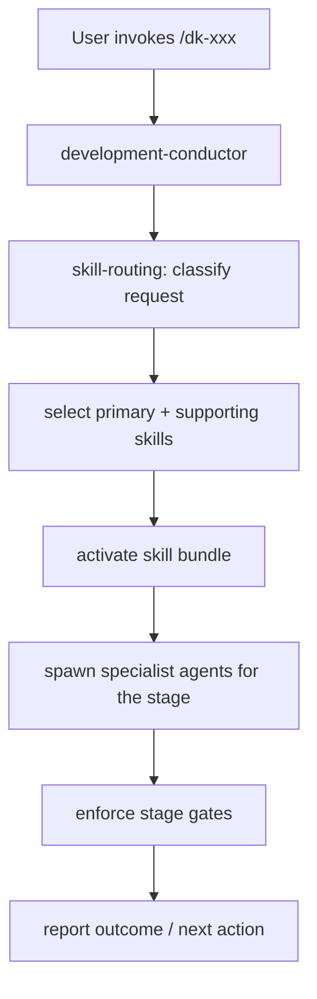

# Command Routing

## How a Command Is Handled

1. The conductor receives the command.
2. `skill-routing` classifies the request and selects the primary + supporting skill bundle (see [skill-loading-and-routing.md](skill-loading-and-routing.md)).
3. The conductor spawns the appropriate specialist agents.
4. Stage gates are enforced (approvals, tests, reviews).
5. The outcome is reported and the workflow advances.

## Command Inventory (14)

| Command | Primary Skill | Stage | Agents Spawned |
| :--- | :--- | :--- | :--- |
| `/dk-autopilot` | using-development-kit | lifecycle-wide | specialist agents selected for each stage |
| `/dk-idea` | idea-discovery | UNDERSTAND | product-discovery-agent, repository-scout-agent |
| `/dk-research` | external-research | conditional / any stage | repository-scout-agent; security-reviewer when provider risk requires review |
| `/dk-spec` | adaptive-artifact-planning | DEFINE | artifact-selector-agent, specification-agent |
| `/dk-design` | technical-design | DESIGN | solution-architect-agent, repository-scout-agent |
| `/dk-tasks` | task-decomposition | PLAN | task-planner-agent |
| `/dk-build` | subagent-driven-implementation | IMPLEMENT | scout, implementation-agent (fresh), test-engineer, spec/code/simplicity reviewers |
| `/dk-build-auto` | subagent-driven-implementation | IMPLEMENT | same as `/dk-build`, replayed over the plan |
| `/dk-test` | verification-before-completion | VERIFY | test-engineer |
| `/dk-review` | specification-compliance-review | REVIEW | spec/code/security/accessibility/design reviewers |
| `/dk-simplify` | simplicity-review | SIMPLIFY | simplicity-reviewer |
| `/dk-debug` | systematic-debugging | recovery | scout, test-engineer, implementation-agent |
| `/dk-ship` | branch-completion | COMPLETE | conductor gates (hooks) |
| `/dk-status` | skill-routing | anytime | none (state report) |

## Command File Contract

Each command file (`commands/dk-*.md`) has:

- YAML frontmatter with `name` and `description`
- `## Purpose` and `## Workflow` sections
- Skills activated (primary + supporting + review gates)
- Sub-agents used
- Stopping conditions

`npm run validate` enforces the frontmatter and section contract.

See [command-selection-matrix.md](../03-reference/commands/command-selection-matrix.md) for the user-facing decision tree.
