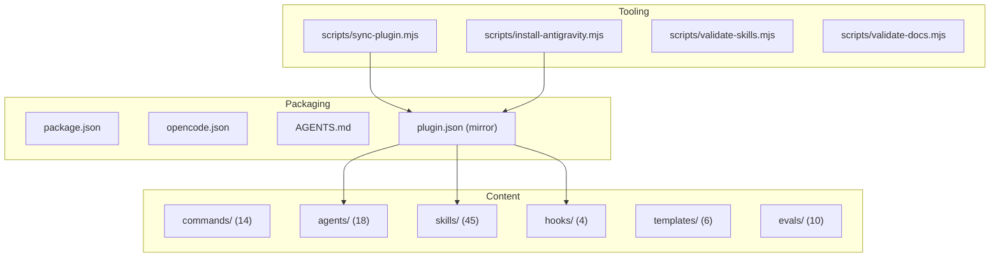

# Component Architecture

## Components

## Component Roles

| Component | Count | Role |
| :--- | :--- | :--- |
| `commands/` | 14 | Slash-command definitions; each maps to a workflow bundle |
| `agents/` | 18 | Agent personas; the conductor orchestrates the other 17 |
| `skills/` | 45 | Lifecycle and conditional research skills; routed per command via `skill-routing` |
| `hooks/` | 4 | Antigravity lifecycle hooks (session, task boundaries, completion) |
| `templates/` | 6 | Artifact templates produced by agents |
| `evals/` | 10 | Behavioural evaluation scenarios for skills |
| `scripts/` | 4 | Installer, sync, and two validators |
| `package.json` | — | Package metadata, bin entry, scripts, engines |
| `opencode.json` | — | OpenCode rule loading (`AGENTS.md`) |
| `AGENTS.md` | — | Always-on rules loaded at session start |

## Dependencies Between Components

- **Commands → skills**: each command activates a primary + supporting skill bundle (see [skill-loading-and-routing.md](skill-loading-and-routing.md)).
- **Commands → agents**: the conductor spawns agents per command stage.
- **Hooks → skills/AGENTS.md**: `session-start` loads `using-development-kit`; `before-task` implements `task-readiness-check`.
- **Manifest → content**: `plugin.json` references skills, agents, and hooks; `sync-plugin.mjs` keeps it in sync.
- **Templates ↔ agents**: agents produce artifacts using the templates.

See [repository-architecture.md](repository-architecture.md) for file layout details.
