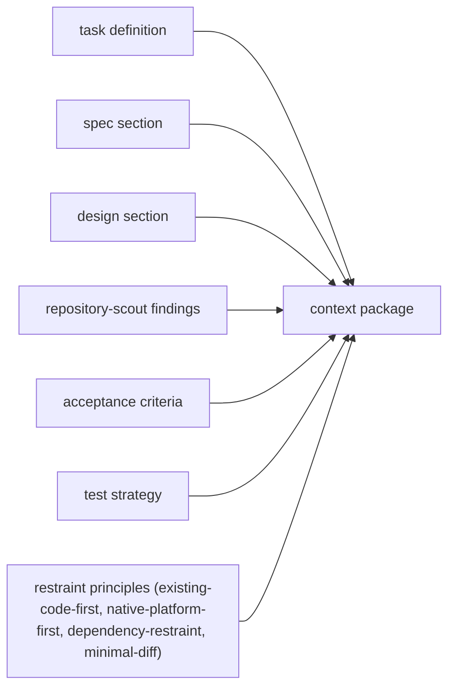
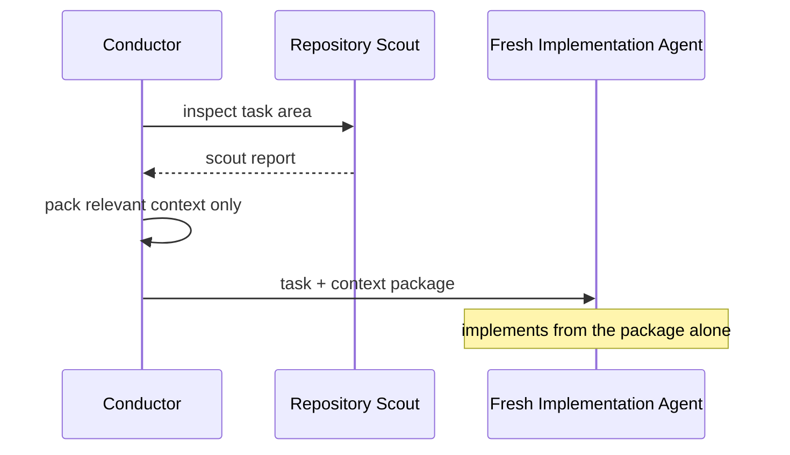

# Context Packing

## Purpose

The `context-packing` skill assembles **only the relevant** code, documents, conventions, and history for a sub-agent, preventing context bloat while keeping the package self-contained.

## Context Package Contents

## Packing Rules

1. **Relevance only** — unrelated code, docs, and history are excluded.
2. **Self-contained** — the fresh agent needs nothing else to start work.
3. **Scope-bounded** — other tasks' details are not included.
4. **Fresh per task** — a package is never reused across tasks.

## Why It Matters

- Prevents context bloat in long sessions (the conductor does not carry full repository context for every task).
- Enables **fresh sub-agent isolation**: a new agent with a tight package cannot inherit stale assumptions.
- Keeps sub-agent context windows small enough to be effective.

## Flow

See [context-packing.md](../03-reference/skills/context-packing.md) and [implementation-agent-isolation.md](../06-internals/implementation-agent-isolation.md).
