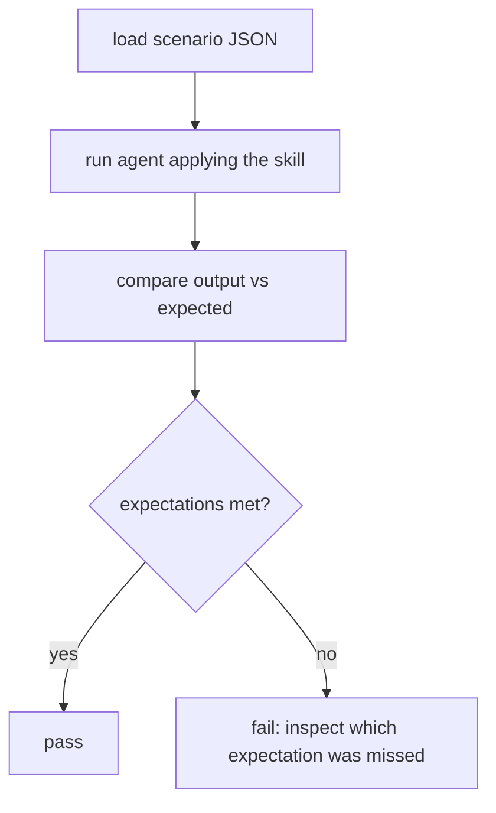

# Evaluation Architecture

## Purpose

Evaluations measure whether agents applying the skills produce the **expected behaviour** — distinct from structural validation (which only checks file shapes).

## Structure

```text
evals/
├── <skill-name>/              # 10 suites, one per evaluated skill
│   └── scenario-01-<topic>.json
```

Each scenario JSON declares:

| Field | Meaning |
| :--- | :--- |
| `skill` | The skill under evaluation |
| `scenario` | Human description of the case |
| `input` / `implementation` | The case presented to the agent |
| `expected` | Behavioural expectations (`must`, `must_not`, `verdict_contains`, minimums) |

## Execution Model



There is **no automated runner** in the repository — scenarios are executed manually or semi-automatically against a live agent/model. See [evaluation-strategy.md](../07-testing-quality-security/evaluation-strategy.md).

## Coverage

10 suites · 1 scenario each. Evaluated skills: acceptance-criteria-writing, code-quality-review, dependency-restraint, idea-discovery, scope-definition, simplicity-review, specification-compliance-review, subagent-driven-implementation, task-decomposition, test-driven-development.

## Relationship to Validation

- `npm run validate` = structure only (files exist, frontmatter valid).
- Evaluations = behaviour (does the agent produce the right output?).
- Both are required for confidence; neither replaces the other.

See [evaluation-internals.md](../06-internals/evaluation-internals.md) and [adding-an-evaluation.md](../05-developer-guide/adding-an-evaluation.md).
