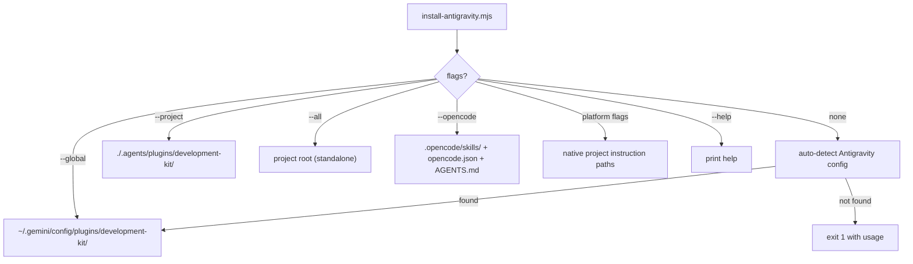

# Installer Architecture

## Entry Points

- `npx development-kit init` (npm bin)
- `npm run init` (repo)
- `node scripts/install-antigravity.mjs` (direct)

## Modes

## Copy Logic

| Mode | Copies | Rewrites | Guards |
| :--- | :--- | :--- | :--- |
| global/project | skills, agents, hooks, commands → plugin dir; AGENTS.md | manifest `../../../` → `./` | AGENTS.md skipped unless `--force` |
| all | 7 dirs + AGENTS.md + README.md + plugin.json | — (plugin.json copied unmodified) | AGENTS.md/README.md skipped unless `--force`; package.json never touched |
| opencode | 45 skills → `.opencode/skills/`; opencode.json; AGENTS.md | — | existing items skipped unless `--force` |

Adapter mode installs packaged templates at the current project's official native paths. Claude receives `CLAUDE.md` and 14 command skills under `.claude/skills/`; Cursor receives `.cursor/rules/dkf.mdc`; VS Code with GitHub Copilot receives `.github/copilot-instructions.md`; Cline receives `.clinerules/dkf.md`; and Windsurf receives `.windsurf/rules/dkf.md`. The installer does not create `.vscode/settings.json` or legacy root rule files.

## Safety & Dry-Run

- `--dry-run` prints what would be copied **without writing**; it is valid with `--all`, `--opencode`, or platform adapter flags (else exit 1).
- `--force` overrides the exists-guards for `AGENTS.md`/`README.md`/skills — the only way to overwrite user files.
- Library content is updated unconditionally on re-run; root files are preserved.
- Every existing adapter destination is preserved unless `--force` is supplied; forced adapter writes replace rather than merge.

## Failure & Recovery

- Auto-detect failure → exit 1 with the list of explicit flags.
- Manifest path-rewrite failure → fallback to direct copy (logged, non-fatal).
- Recovery: [uninstalling.md](../02-user-guide/uninstalling.md) then reinstall.

See [installer-internals.md](../06-internals/installer-internals.md) and [testing-installer-changes.md](../05-developer-guide/testing-installer-changes.md).
