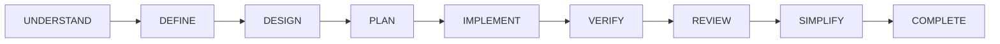
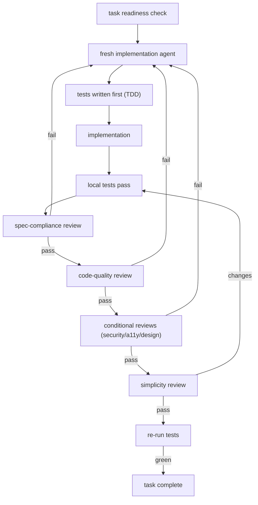

# Lifecycle Orchestration

## The Lifecycle

Stages are sequential and gated: no stage starts until the previous stage's approvals exist. The development-conductor is the coordinator at every stage.

## Command → Stage Mapping

| Command | Stage | Conductor Action |
| :--- | :--- | :--- |
| `/dk-idea` | UNDERSTAND | Spawns product-discovery-agent; applies idea skills |
| `/dk-spec` | DEFINE | Spawns artifact-selector + specification-agent |
| `/dk-design` | DESIGN | Spawns solution-architect-agent (+ scout) |
| `/dk-tasks` | PLAN | Spawns task-planner-agent |
| `/dk-build` | IMPLEMENT → ... → COMPLETE | Runs the mandatory task loop per task |
| `/dk-build-auto` | IMPLEMENT → ... → COMPLETE | Replays the task loop for the whole plan |
| `/dk-test` | VERIFY | Spawns test-engineer |
| `/dk-review` | REVIEW | Spawns reviewers in fixed order |
| `/dk-simplify` | SIMPLIFY | Spawns simplicity-reviewer |
| `/dk-debug` | (recovery) | Spawns scout + test-engineer + implementer |
| `/dk-ship` | COMPLETE | Runs completion gates |
| `/dk-status` | (anytime) | Reports workflow state |

## Gate Flow Within a Task

## Mandatory Task Loop

1. Conductor selects next task
2. Repository scout gathers task context
3. Task-readiness agent validates task
4. Fresh implementation sub-agent starts
5. Test is written first where behaviour changes
6. Minimal implementation is produced
7. Local tests are run
8. Spec reviewer checks compliance
9. Code reviewer checks quality
10. Test engineer performs bug and regression testing
11. Simplicity reviewer removes overengineering
12. Tests run again
13. Task is committed
14. Only then does the next task begin

See [mandatory-task-loop.md](../01-overview/mandatory-task-loop.md), [agent-orchestration.md](agent-orchestration.md), and [task-state-and-completion-gates.md](task-state-and-completion-gates.md).
