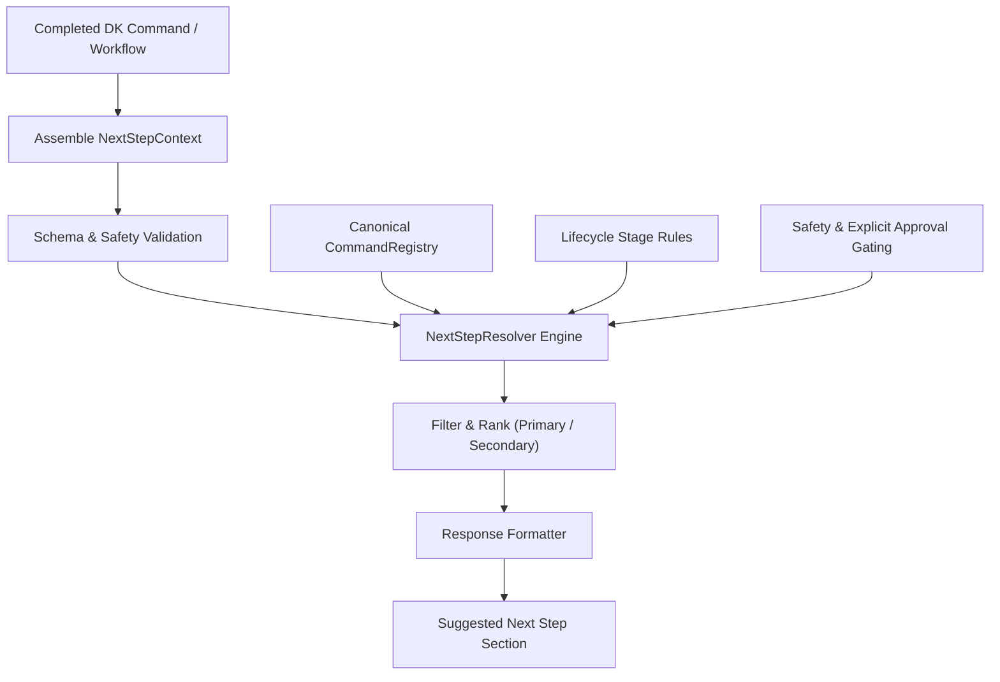

# Next-Step Guidance Architecture

## System Overview

Development Kit Next-Step Guidance is a centralized, context-aware subsystem that recommends the single most logical valid `/dk-*` command to run at completed workflow milestones.

## Architectural Components

### 1. Canonical Command Registry (`runtime/next-step/command-registry.mjs`)
The `CommandRegistry` maintains the single source of truth for all 14 registered `/dk-*` commands and their metadata.
- **Dynamic discovery**: Discovers command definitions in `commands/` while preserving immutable canonical definitions.
- **Safety metadata**: Annotates commands with `isConsequential`, `requiresApproval`, `safetyLevel` (`safe`, `read_only`, `consequential`), and stage associations.
- **Validation gate**: Strictly prevents recommending any command that does not exist.

### 2. Next-Step Resolver Engine (`runtime/next-step/resolver.mjs`)
The `NextStepResolver` implements the core recommendation and safety policies:
- **Rule 1 (Valid Commands Only)**: Checks every candidate against the canonical command registry.
- **Rule 2 (Lifecycle-Aware)**: Sequences transitions through the 9-stage lifecycle:
  `UNDERSTAND` → `DEFINE` → `DESIGN` → `PLAN` → `IMPLEMENT` → `VERIFY` → `REVIEW` → `SIMPLIFY` → `COMPLETE`.
- **Rule 3 (Failure Overrides Progression)**: When operations fail, tests break, or blockers are present, normal forward progression is halted in favor of remediation (`/dk-debug`, retry implementation, or re-verification).
- **Rule 4 (Consequential Safety & Explicit Multi-Gate Ship Predicate)**:
  Recommending `/dk-ship` requires all 9 conditions to be explicitly true:
  1. `success === true`
  2. `approvalStatus === 'approved'`
  3. `verificationStatus === 'passed'`
  4. `testsStatus === 'passed'`
  5. `reviewStatus === 'passed'`
  6. `postSimplificationVerificationStatus === 'passed'`
  7. `blockers` is an empty array
  8. `outstandingApprovals` is an empty array
  9. `isAutomated === false`
  Earlier test passes do not satisfy the post-simplification regression gate (`postSimplificationVerificationStatus`). After `/dk-simplify`, the only primary recommendation is `/dk-test`.
- **Rule 5 (No Unnecessary Repetition)**: Avoids recommending the identical completed command unless iterative tasks remain.
- **Rule 6 (Prioritization & Max Limit)**: Returns exactly one primary recommended command, with optional secondary recommendations (default max: 3).
- **Rule 7 (No Recommendation When Inappropriate)**: Emits no recommendation section when the workflow is completed (`isWorkflowComplete: true`) or intermediate execution is suppressed during active automation.
- **Rule 8 (Guidance is Not Execution)**: Emits recommendations for user review without side-effects or automatic invocation.

### 3. Response Formatter (`runtime/next-step/formatter.mjs`)
Formats recommendations into canonical Markdown with context-sensitive headings (`## Suggested Next Step` for singular, `## Suggested Next Steps` for plural).

### 4. CLI Bridge & Schema Validator (`scripts/next-step.mjs` & `runtime/next-step/types.mjs`)
Provides command-line query capabilities with strict input schema validation, nonzero exit codes on malformed inputs, and JSON/Markdown output formatting.

## Lifecycle Transition Matrix

| Current Stage | Completed Command | Outcome | Recommended Next Command | Gating & Context Rules |
| :--- | :--- | :--- | :--- | :--- |
| `UNDERSTAND` | `/dk-idea` | Success | `/dk-spec` | Concept approved |
| `RESEARCH` | `/dk-research` | Success | `/dk-spec` | Integrate research evidence |
| `DEFINE` | `/dk-spec` | Success | `/dk-design` | Specification approved |
| `DESIGN` | `/dk-design` | Success | `/dk-tasks` | Technical design complete |
| `PLAN` | `/dk-tasks` | Success | `/dk-build` | Secondary: `/dk-build-auto` |
| `IMPLEMENT` | `/dk-build` (tasks remain) | Success | `/dk-build` | Next task in plan |
| `IMPLEMENT` | `/dk-build` (all done) | Success | `/dk-test` | Implementation verification gate |
| `IMPLEMENT` | `/dk-build-auto` | Batch Done | `/dk-test` | Full plan verification |
| `VERIFY` | `/dk-test` | Passed | `/dk-review` | Verification passed |
| `VERIFY` | `/dk-test` | Failed | `/dk-debug` | Systematic root-cause debugging |
| `REVIEW` | `/dk-review` | Passed | `/dk-simplify` | Review approved |
| `REVIEW` | `/dk-review` | Failed | `/dk-build` | Implementation fixes required |
| `SIMPLIFY` | `/dk-simplify` | Success | `/dk-test` | Mandatory regression test (no direct ship) |
| `COMPLETE` | Pre-ship | Approved & Verified | `/dk-ship` | Requires all 9 explicit ship conditions |
| `COMPLETE` | `/dk-ship` | Complete | *(None)* | Terminal state (`isWorkflowComplete: true`) |
| Any | Any | Paused | `/dk-status` | State and lease inspection |
| Any | Any | Blocker Present | `/dk-debug` | Halts forward progression |
| Any | Unknown | Invalid Command | `/dk-status` | Safe state inspection |
