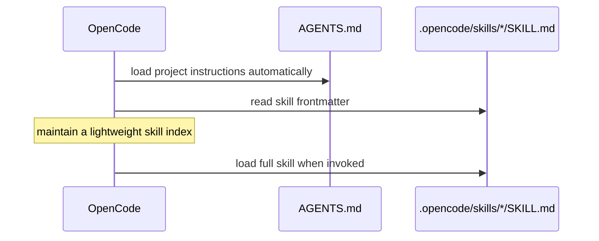

# OpenCode Integration

## Installed integration

`npx development-kit@latest init --opencode` installs:

```text
project/
├── .opencode/skills/        # 43 skill directories
├── opencode.json            # official schema declaration
└── AGENTS.md                # automatically loaded project rules
```

The generated project configuration is:

```json
{
  "$schema": "https://opencode.ai/config.json"
}
```

## Rules loading

OpenCode automatically loads the root `AGENTS.md`. Development Kit therefore does not register that file through a custom top-level key.

The obsolete configuration below is unsupported and must not be generated:

```json
{
  "rules": ["AGENTS.md"]
}
```

Current OpenCode versions reject that key with `Unrecognized key: rules`.

Projects can use the supported `instructions` array for additional project-specific instruction files or URLs when needed. Development Kit does not add that array by default because `AGENTS.md` discovery already provides the required rules.

## Skill discovery

OpenCode discovers `SKILL.md` files under `.opencode/skills/`. It also recognizes compatible skill locations such as `.claude/skills/` and `.agents/skills/`.

Skills are loaded progressively:

1. At session start, OpenCode reads the skill name and description.
2. Full skill content is loaded when the skill is invoked.



## Compatibility metadata

All 43 skills declare OpenCode compatibility in frontmatter. `npm run validate` verifies framework structure and compatibility metadata.

## Configuration validation

`npm run opencode:validate` runs the OpenCode configuration regression suite. It verifies that:

- `opencode.json` is valid JSON.
- The root value is an object.
- `$schema` equals `https://opencode.ai/config.json`.
- The obsolete `rules` key is absent.
- `instructions`, when present, is an array of strings.

The same gate is included in CI and `npm run release:validate`.

## Installer guardrails

- Existing `.opencode/skills/<name>`, `opencode.json`, and `AGENTS.md` are skipped unless `--force` is supplied.
- `--dry-run` previews installation changes.
- Existing project rules are preserved by default.

See [Install OpenCode](../02-user-guide/install-opencode.md), [OpenCode Workflow](../10-examples/opencode-workflow.md), and [Validation Reference](../07-testing-quality-security/validation-reference.md).
