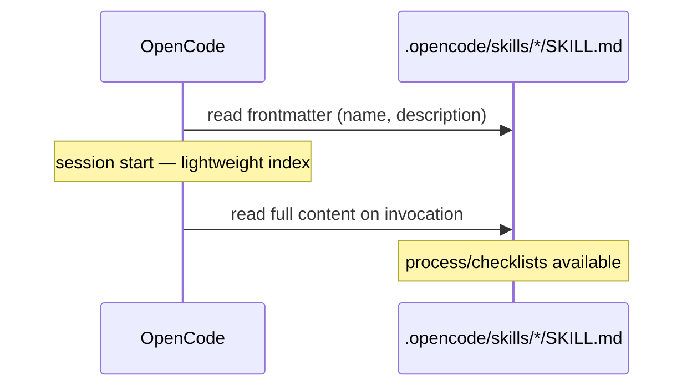

# OpenCode Integration

## What OpenCode Gets

Installed by `npx development-kit init --opencode`:

```text
project/
├── .opencode/skills/        # 43 skill dirs (auto-discovery path)
├── opencode.json            # { "rules": ["AGENTS.md"] }
└── AGENTS.md                # always-on rules
```

## Discovery Mechanism

OpenCode auto-discovers `SKILL.md` files in `.opencode/skills/` (also `.claude/skills/` and `.agents/skills/`). Skills are loaded **progressively**:

1. At session start only `name` and `description` (frontmatter) are loaded.
2. Full skill content is loaded when the agent invokes the skill.



## Compatibility Metadata

All 43 skills declare `compatibility: opencode` in frontmatter. This is validated by `npm run validate` (frontmatter presence) and documented per skill.

## Rules Loading

`opencode.json` (`{ "rules": ["AGENTS.md"] }`) instructs OpenCode to load `AGENTS.md` as always-on rules — the 12 always-on rules and the Ponytail ladder.

## Guardrails

- Existing `.opencode/skills/<name>` and `opencode.json`/`AGENTS.md` are skipped on reinstall unless `--force`.
- `--dry-run` previews the install.

See [install-opencode.md](../02-user-guide/install-opencode.md) and [opencode-workflow.md](../10-examples/opencode-workflow.md).
