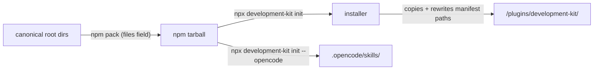

# Plugin Packaging

## What Is Packaged

`package.json` `files` field defines the npm package contents:

```json
[
  ".agents/", "agents/", "skills/", "commands/", "hooks/",
  "templates/", "evals/", "scripts/", "AGENTS.md", "README.md", "opencode.json"
]
```

The `bin` entry exposes `development-kit` → `scripts/install-antigravity.mjs`, enabling `npx development-kit init`.

## Plugin Structure (Antigravity)

An installed Antigravity plugin is self-contained at `<target>/plugins/development-kit/`:

```text
plugins/development-kit/
├── plugin.json        # manifest with ./ paths (rewritten from ../../../)
├── skills/            # copied
├── agents/            # copied
├── hooks/             # copied
└── commands/          # copied
```

## Packaging Flow



## Manifest

`plugin.json` (`.agents/plugins/development-kit/plugin.json`) declares the plugin: `name`, `version`, and references for 63 skills, 18 agents, and 4 hooks. It is regenerated by `sync-plugin.mjs`.

## Version Alignment

- `package.json`: aligned to current release line (`0.9.0`)
- npm tag: version-aligned `v*` tag
- `plugin.json` and committed plugin manifest: strictly aligned via `scripts/sync-plugin.mjs` and verified by `npm run doctor`

## Publishing

Publishing is automated by `.github/workflows/publish.yml` on `v*` tags: validation, tag↔package version check, then `npm publish` with the `NPM_TOKEN` secret. See [npm-publishing.md](../08-maintenance-release/npm-publishing.md).
