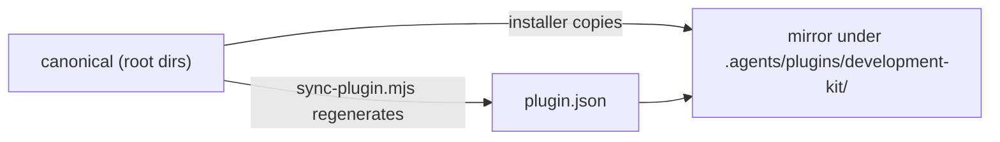

# Repository Architecture

## Layout

```text
development-kit/
├── .agents/plugins/development-kit/   # Plugin mirror + manifest (generated/synced)
├── .github/workflows/                 # CI + publish workflows
├── agents/                            # 18 agent personas (canonical)
├── commands/                          # 14 slash commands (canonical)
├── skills/                            # 45 skills, each a dir with SKILL.md (canonical)
├── hooks/                             # 4 lifecycle hooks (canonical)
├── templates/                         # 6 artifact templates (canonical)
├── evals/                             # 11 evaluation suites (canonical)
├── scripts/                           # 4 tooling scripts (canonical)
├── docs/                              # This documentation system
├── AGENTS.md                          # Always-on rules
├── opencode.json                      # OpenCode rule configuration
└── package.json                       # Package metadata + scripts
```

## Canonical vs Mirrored

| Location | Nature | Edit Rule |
| :--- | :--- | :--- |
| `agents/`, `skills/`, `commands/`, `hooks/`, `templates/`, `evals/`, `scripts/` | **Canonical source** | Edit here only |
| `.agents/plugins/development-kit/{agents,skills,commands,hooks}/` | **Mirror copies** (content-equivalent files) | Never edit directly |
| `.agents/plugins/development-kit/plugin.json` | Generated manifest | Regenerate via `sync-plugin.mjs` |

The mirror content is required to be content-equivalent to canonical. The synchronization check normalizes CRLF and LF line endings before comparison, while material content differences and inventory drift remain release-blocking. The mirror is maintained by copying at install/sync time, not by junctions.



## Tooling Placement

- `scripts/sync-plugin.mjs` resolves paths relative to the plugin directory (`../../../<dir>/...`); the installer rewrites them to `./` for installed copies.
- `scripts/validate-skills.mjs` resolves manifest references relative to the manifest's own directory — both path forms resolve correctly.
- The published npm package includes `.agents/`, `agents/`, `skills/`, `commands/`, `hooks/`, `templates/`, `evals/`, `scripts/`, `AGENTS.md`, `README.md`, and `opencode.json` per the `files` field.

See [canonical-source-and-plugin-mirror.md](canonical-source-and-plugin-mirror.md) and the [source-of-truth-map.md](../00-documentation/source-of-truth-map.md).
