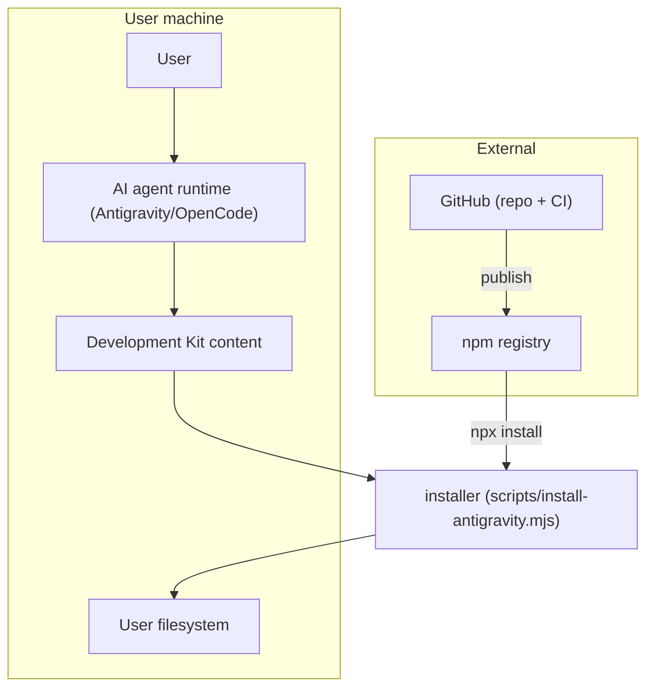

# Security & Trust Boundaries

This page maps trust boundaries and the security posture of the framework itself. See [threat-model.md](../07-testing-quality-security/threat-model.md) for the full threat analysis.

## Trust Boundaries

## Boundary Inventory

| Boundary | Actors | Risks |
| :--- | :--- | :--- |
| Agent → content | Agent executes methodology from package files | Malicious content (prompt injection) could steer the agent |
| Installer → filesystem | Installer copies files into config dirs / project root | Overwrites, path mistakes, `--force` misuse |
| Repo → npm | Publish workflow pushes the package | Compromised credentials, wrong version, secrets in package |
| User → agent | User supplies requests and answers | Prompt injection via repository or user content |

## Security Posture (Implemented)

- **No symlink/junction creation** — the installer uses plain copies (`cpSync`/`copyFileSync`); no path traversal via symlinks is introduced.
- **Overwrite guards** — `AGENTS.md`/`README.md`/skills are never overwritten without `--force`.
- **`package.json` is never touched** in `--all` mode.
- **`--dry-run`** writes nothing.
- **No secrets in code** — the only secret reference is the CI `NPM_TOKEN` in the publish workflow, resolved from GitHub secrets, never checked in.
- **Read-only validators** — all validation scripts only read.

## What Is NOT Claimed

- No digital signing of the package.
- No sandboxing of the agent runtime.
- No guarantee that downloaded package content is malware-free beyond npm provenance.
- The framework **does not** harden the user's application — the `security-review` skill reviews the *user's* code, not the framework itself.

See [threat-model.md](../07-testing-quality-security/threat-model.md) for the detailed risk register.
