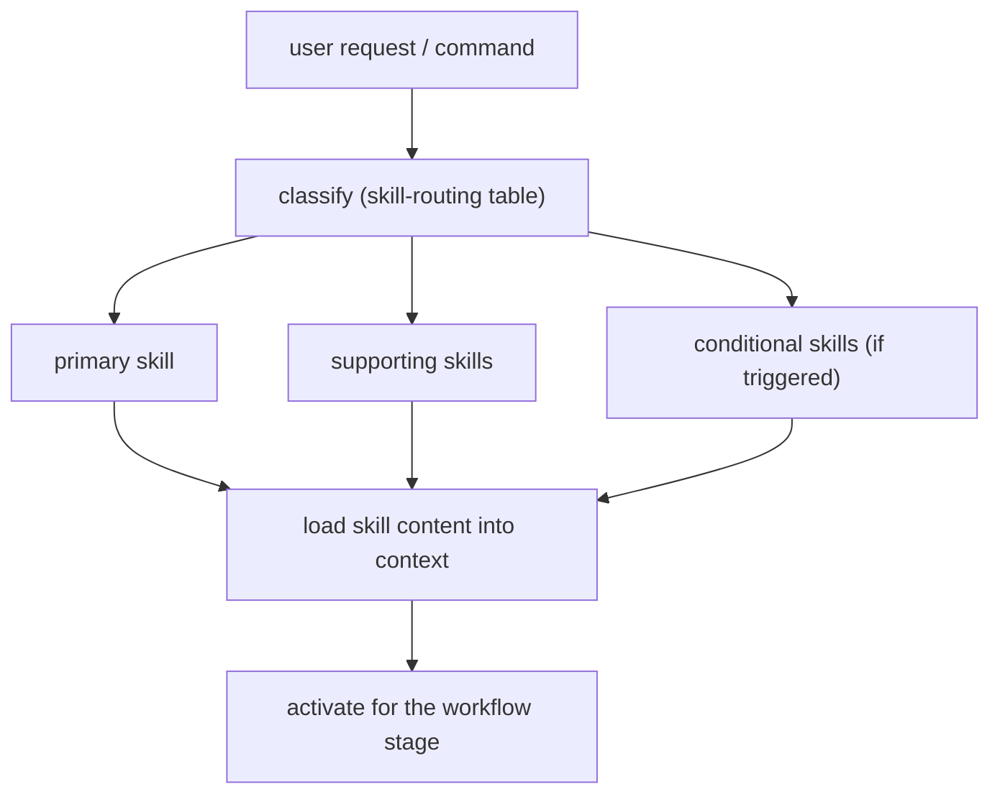

# Skill Loading & Routing

## Routing Model

Skills are selected by the conductor via `skill-routing`, never loaded wholesale. Loading all skills at once is rejected as context bloat.



## Skill Resolution

- Skills live in `skills/<name>/SKILL.md` (canonical) and are listed in `plugin.json`.
- OpenCode auto-discovers `SKILL.md` files from `.opencode/skills/` (also `.claude/skills/`, `.agents/skills/`), loading only `name`/`description` at session start and full content on invocation.
- Antigravity loads skills through the plugin's `skills/` directory per the manifest.

## Frontmatter Contract

Every `SKILL.md` declares:

```yaml
---
name: <skill-name>
description: >-
  <what the skill does and when it is used>
compatibility: opencode
---
```

`npm run validate` checks `name`, `description`, and the recommended `Overview`/`Process` sections.

## Routing Table Sources

The routing data lives in:

- `skills/skill-routing/SKILL.md` — the canonical routing table (request signals + command bundles)
- `docs/03-reference/skills/skill-routing-matrix.md` and `lifecycle-to-skill-map.md` — documentation mirrors

## Related

- [command-routing.md](command-routing.md)
- [context-packing.md](context-packing.md)
- [using-development-kit.md](../01-overview/framework-at-a-glance.md)
