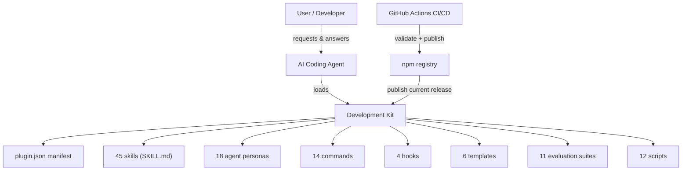

# System Context

## Overview

Development Kit is a content-and-tooling package consumed by AI coding agents in two runtime environments (Antigravity and OpenCode), distributed via npm, and maintained as a GitHub repository with CI/CD.

## Actors

| Actor | Relationship |
| :--- | :--- |
| **User** | Provides requests and answers to interview questions; approves specs, designs, plans |
| **AI coding agent** | Executes the methodology inside Antigravity or OpenCode |
| **Maintainer** | Edits canonical sources; runs sync and validation; releases versions |
| **CI/CD** | Validates on push/PR; publishes npm on version tags |

## Trust Boundaries

- The **agent runtime** (Antigravity/OpenCode) loads and executes content from the package.
- The **installer** writes into user directories — the only component that touches the user's filesystem.
- The **npm publish workflow** is the only path that pushes the package to the registry.

See [security-trust-boundaries.md](security-trust-boundaries.md) for the detailed threat model.
