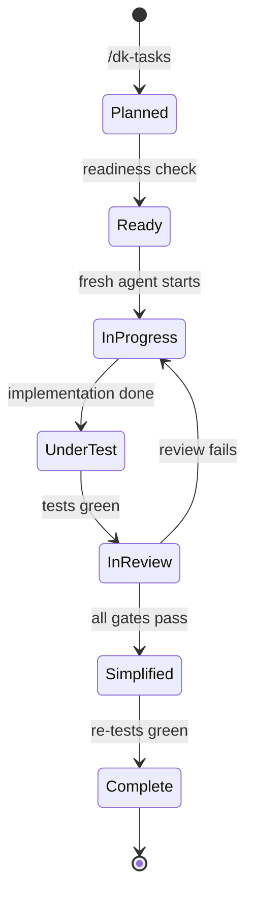

# Task State & Completion Gates

## Task Lifecycle

## Completion Gates (task-completion-gate)

A task is complete **only** when all of these pass:

1. **Acceptance criteria** — verified against the implementation
2. **Tests** — unit/integration/browser suite green
3. **Spec-compliance review** — gate 1 (did we build the right thing?)
4. **Code-quality review** — gate 2 (did we build it well?)
5. **Conditional reviews** — security / accessibility / design when triggered
6. **Simplicity review** — final gate, then tests re-run

## Hook Implementation

| Hook | Implements |
| :--- | :--- |
| `hooks/before-task.js` | Task readiness validation (`objective`, `requirements`, `acceptanceCriteria`, `verification`, `exclusions`) |
| `hooks/after-task.js` | Gate verification (`verifyTaskGates`) + completion recording |
| `hooks/before-completion.js` | Completion readiness (`allTasksComplete`, gates, docs, issues) → `canShip` |

## Sequentiality Rule

> **Do not start the next task while the current task has unresolved failures.**

The conductor enforces this: task N+1 is not selected until task N passes its completion gate. `/dk-status` reflects this state.

## State Tracking

- `/dk-status` reports: active lifecycle stage, current task, completed tasks, pending reviews, blocked items.
- Completion records from `after-task` hook feed this report.
- There is no persistent state file — state is derived from the workflow run's artifacts and reports (see [known-limitations.md](../11-appendices/known-limitations.md)).

See [task-completion-gate.md](../03-reference/skills/task-completion-gate.md) and [hook-runtime-internals.md](../06-internals/hook-runtime-internals.md).
