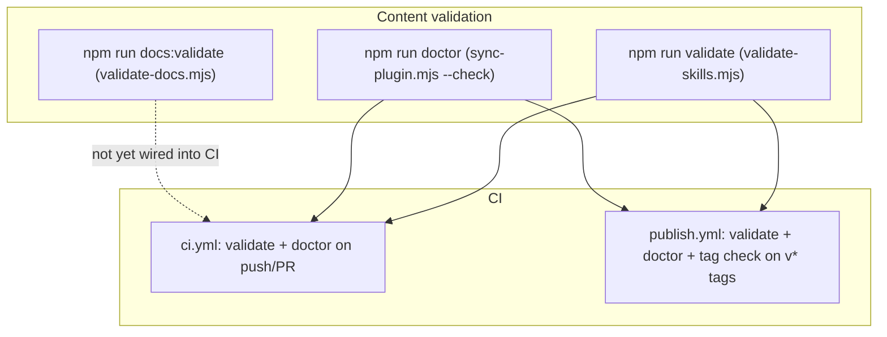

# Validation Architecture

## Validation Layers

## What Each Validator Checks

| Validator | Checks | Fails On |
| :--- | :--- | :--- |
| `validate-skills.mjs` | Skill frontmatter (`name`, `description`), recommended sections, agent/command structure, manifest reference resolution | Errors only (warnings allowed); exit 1 |
| `sync-plugin.mjs --check` | Manifest counts vs directories; missing entries | Never (reports drift, exits 0) |
| `validate-docs.mjs` | Reference-page coverage, link integrity, placeholders, `file://` protocol URLs, SUMMARY navigation | Errors only; exit 1 |

## CI Coverage

- `ci.yml`: runs on push/PR to `main` — `validate-skills.mjs` + `sync-plugin.mjs --check` on Node 22.
- `publish.yml`: same validations, then tag↔package version match, then `npm publish`.

## Gaps (documented)

- `docs:validate` is not wired into CI yet (see [Known Limitations](../11-appendices/known-limitations.md)).
- The doctor check does not fail CI even when it reports drift.

See [validation-reference.md](../07-testing-quality-security/validation-reference.md) and [validator-internals.md](../06-internals/validator-internals.md).
