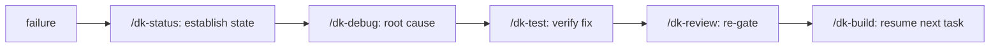

# Error Handling & Failure States

## Failure States by Component

### Installer

| State | Behaviour |
| :--- | :--- |
| No target found (auto-detect) | Prints usage with all flags; exit 1 |
| `--dry-run` without mode | Prints usage; exit 1 |
| Manifest rewrite failure | Logs error, falls back to direct copy (non-fatal) |
| Mid-copy failure | Partial copy; no rollback — re-run completes |
| Existing guarded files | Skipped (guard); `--force` overrides |

### Validators

| State | Behaviour |
| :--- | :--- |
| Structural error | `✗` line + collected; exit 1 |
| Warning | `⚠` line; non-blocking |
| Manifest drift | Reported; exit 0 (see [plugin-sync-internals.md](plugin-sync-internals.md)) |
| Broken doc link / missing page | `✗` line + collected; exit 1 |

### Hooks

| State | Behaviour |
| :--- | :--- |
| Task missing fields | `issues[]` populated; `ready: false` |
| Missing securityReview | Defaults to passed |
| Completion blockers | `issues[]` populated; `canShip: false` |
| Hook throw | Session continues (hooks are advisory) |

### Workflow (Conductor)

| State | Routing |
| :--- | :--- |
| Test failure | → test-engineer + fresh implementation agent |
| Spec review FAIL | → back to implementation |
| Code review critical | → back to implementation |
| Task blocker | → surface to user |
| Ambiguity | → sequential interview |

## Recovery Paths

## Non-Existent Failure Handling (Documented)

- No transactional installer (no rollback on partial copy).
- No automatic retry in validators (re-run manually).
- No crash reporting; errors are console output.
- Hooks have no logging framework.

These are accepted constraints for a small, dependency-free toolset — recorded in [known-limitations.md](../11-appendices/known-limitations.md).
