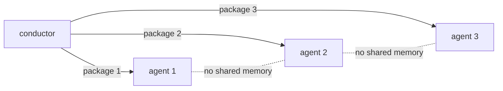

# Implementation Agent Isolation

## The Isolation Guarantee

Every implementation task is executed by a **fresh** agent instance (`implementation-agent`, or a specialist variant). The guarantee:

> No agent that implemented task N has any context from tasks 1..N-1 unless explicitly packaged.

## Why It Prevents Assumption Drift

Long-running agents accumulate assumptions from earlier work ("I already know how this project works", "the last task established X"). Fresh instances:

- Read only the packed context
- Re-derive decisions from the current spec/design/scout findings
- Cannot silently carry over stale conclusions

## What the Package Contains

Task description · spec section · design section · allowed scope and exclusions · acceptance criteria · required tests · test strategy · context package · repository-scout findings · restraint principles.

## What the Package Excludes

- Other tasks' details
- Unrelated repository history
- Full specification (only the relevant section)

## Enforcement Points

- `subagent-driven-implementation` skill: "spawn a fresh implementation sub-agent per task"
- Always-on rule 7: "Use a fresh sub-agent for each implementation task"
- Conductor workflow step: "Spawn a **fresh** implementation sub-agent"
- Evaluation: `evals/subagent-driven-implementation/` asserts ≥3 sub-agent assignments with distinct scopes (never one agent for everything)

## Limits

Isolation depends on the runtime creating genuinely independent agent instances. If the runtime reuses model context across "instances", the guarantee weakens — see [known-limitations.md](../11-appendices/known-limitations.md).

See [context-packing.md](../04-architecture/context-packing.md) and [subagent-driven-implementation.md](../03-reference/skills/subagent-driven-implementation.md).
