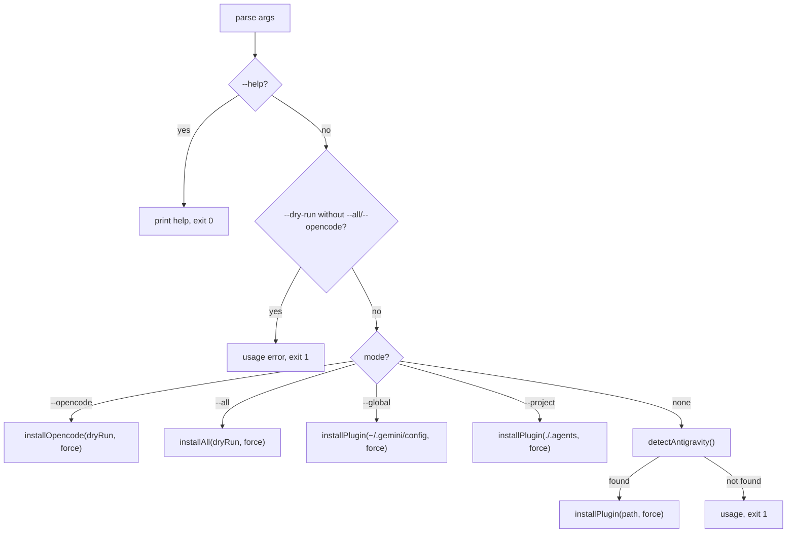

# Installer Internals

## Entry & Flow

`scripts/install-antigravity.mjs` — a zero-dependency Node ESM script. `ROOT` is resolved from the script location (`fileURLToPath(import.meta.url)`), so it works from any working directory.

## Key Mechanics

| Mechanic | Implementation |
| :--- | :--- |
| Directory copies | `cpSync(src, dst, { recursive: true })` — plain copies, no symlinks |
| File copies | `copyFileSync` |
| Manifest path rewrite | `JSON.parse` → map arrays → `s.replace(/^\.\.\/\.\.\/\.\.\//, './')` → write |
| Rewrite fallback | On parse failure: direct copy + logged error (non-fatal) |
| Guards | `existsSync(target) && !force` → skip + message |
| Dry-run | `dryRun` flag gates every write + changes `✓` to `→` |

## Guard Matrix

| File/Dir | Without `--force` | With `--force` |
| :--- | :--- | :--- |
| Target `AGENTS.md` (plugin modes) | skipped | overwritten |
| Root `AGENTS.md` / `README.md` (`--all`, `--opencode`) | skipped | overwritten |
| Existing `.opencode/skills/<name>` | skipped | overwritten |
| `opencode.json` | skipped | overwritten |
| Library dirs (skills/agents/commands/hooks/templates/evals/scripts) | **unconditionally copied** | same |
| `package.json` (`--all`) | **never touched** | same |

## Path Resolution

- `~` → `process.env.HOME || process.env.USERPROFILE || '~'` (cross-platform)
- All paths via `join()` (Windows-safe)
- Auto-detect candidates: `~/.gemini/config`, `./.agents`, `./.gemini` (first existing)

## Exit Codes

- 0: success or `--help`
- 1: invalid `--dry-run` usage, or no target detected

## Failure & Rollback

- No transactional rollback exists — a mid-copy failure leaves partial files (acceptable for the small file set; re-running completes the install).
- Manifest rewrite failure degrades to an unmodified copy.

## Testing

See [testing-installer-changes.md](../05-developer-guide/testing-installer-changes.md) — always test in scratch directories with `--dry-run` first.
