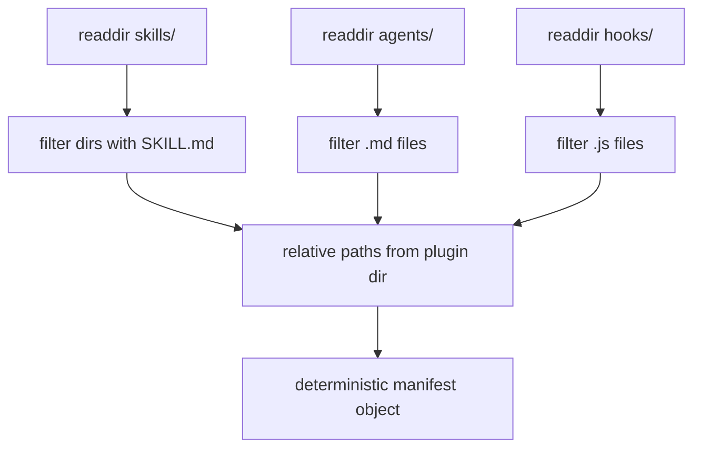

# Plugin Sync Internals

## Purpose

`scripts/sync-plugin.mjs` keeps the committed Antigravity plugin mirror and its `plugin.json` synchronized with canonical root content.

The controlled mirror directories are `skills/`, `agents/`, `commands/`, and `hooks/`.

## Manifest Generation

Generated references use canonical paths such as `../../../skills/<name>`. The installer rewrites them to `./...` for self-contained installed copies.

## Mirror Verification

The read-only verification path recursively enumerates canonical and mirrored files for all four controlled directories.

For each directory it checks:

1. Canonical directory exists.
2. Mirror directory exists.
3. Every canonical file exists in the mirror.
4. No extra mirror file exists.
5. Matching files are content-equivalent after CRLF and LF line endings are normalized; material differences remain drift.

The check separately parses `plugin.json` and compares the complete object with the generated canonical manifest.

## Modes

| Mode | Writes | Notes |
| :--- | :--- | :--- |
| *(none)* | Yes | Replaces controlled mirror directories from canonical, regenerates manifest, then verifies |
| `--fix` | Yes | Same synchronization behavior as no-flag mode |
| `--check` | No | Verifies manifest, inventory, and normalized content equivalence; exits 1 on any material drift |

## Synchronization Mechanics

Write mode removes each controlled mirror directory and recursively copies its canonical counterpart. It does not remove the plugin root itself, so `plugin.json` and other plugin-root state stay under explicit control. After copying, it rewrites `plugin.json` deterministically and runs the same verifier used by `--check`.

## Release-Gate Behavior

`npm run doctor` maps to `node scripts/sync-plugin.mjs --check`. Because `doctor` is part of `npm run release:validate`, committed mirror drift is release-blocking.

This closes the previous gap where the checker could report stale mirror/manifest state without returning a failing exit code.

## What Sync Does NOT Do

- It does not edit canonical root content.
- It does not update package versions.
- It does not install provider runtimes or external dependencies.
- It does not rewrite target-install manifest paths; `install-antigravity.mjs` performs that transformation when creating an installed plugin.

## Idempotency and Safety

With unchanged canonical content, repeated synchronization produces identical mirror content and manifest output. `--check` is read-only. Write modes are restricted to the four controlled mirror directories and `plugin.json` beneath `.agents/plugins/development-kit/`.

See [synchronising-the-plugin-mirror.md](../05-developer-guide/synchronising-the-plugin-mirror.md), [canonical-source-and-plugin-mirror.md](../04-architecture/canonical-source-and-plugin-mirror.md), and [sync-plugin.md](../03-reference/scripts/sync-plugin.md).
