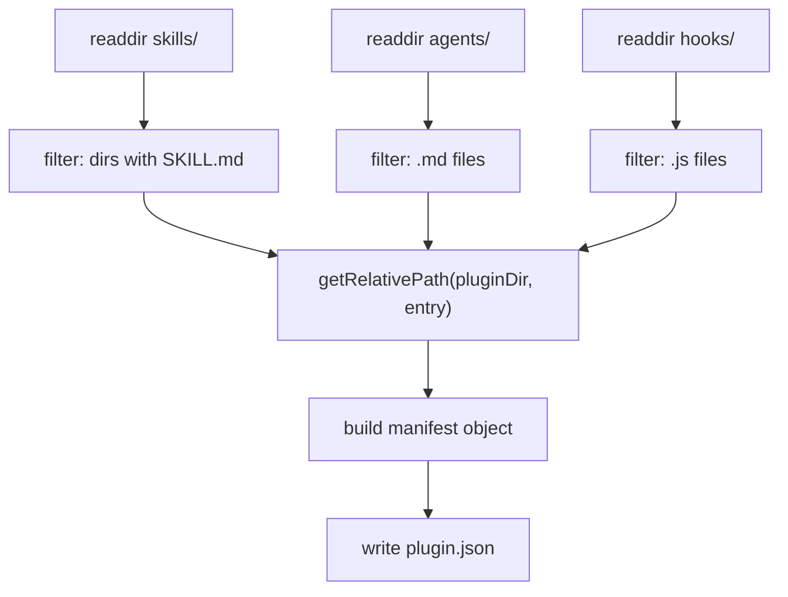

# Plugin Sync Internals

## Purpose

`scripts/sync-plugin.mjs` keeps `.agents/plugins/development-kit/plugin.json` aligned with the canonical `skills/`, `agents/`, and `hooks/` directories.

## Generation Mechanics



- `getRelativePath(from, to)` computes a relative path and prefixes `./` when not `..`.
- Because entries live 3 levels above the plugin dir, generated refs look like `../../../skills/<name>`.
- Output is deterministic (`JSON.stringify(manifest, null, 2)`).

## Modes

| Mode | Writes | Notes |
| :--- | :--- | :--- |
| *(none)* / `--fix` | Yes | Regenerates and reports counts |
| `--check` | No | Compares committed vs generated; reports missing entries; **always exits 0** |

## The Known Drift (Important)

The committed manifest uses `./` prefixes (rewritten form), while generation produces `../../../` prefixes. `--check` therefore reports **all** skills/agents as "missing" despite the files existing:

```
Plugin manifest check:
  Skills: 43 defined, 43 available
  Missing skills: ../../../skills/acceptance-criteria-writing, ...
```

**Resolution**: run `node scripts/sync-plugin.mjs` (no flag) to rewrite the manifest into the canonical generated form. Both path forms resolve correctly for `validate-skills.mjs` and the installer.

## Why `--check` Never Fails

The script has no `process.exit(1)` path in `--check` mode — drift is reported, not enforced. CI therefore does not fail on drift. This is a documented gap (see [known-limitations.md](../11-appendices/known-limitations.md)).

## What Sync Does NOT Do

- Does not copy content files into the mirror (the installer does).
- Does not rewrite paths (the installer does, at install time).
- Does not update `package.json` scripts or versions.

See [synchronising-the-plugin-mirror.md](../05-developer-guide/synchronising-the-plugin-mirror.md) and [canonical-source-and-plugin-mirror.md](../04-architecture/canonical-source-and-plugin-mirror.md).
