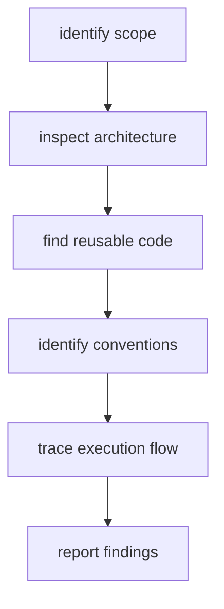

# Repository Scout Internals

## Operating Model

The repository-scout (`agents/repository-scout-agent.md`) is a **read-only inspection persona**. It produces a structured report consumed by design, planning, and implementation agents.

## Inspection Sequence

## Report Contract

The scout report has fixed sections: Relevant Files · Architecture Summary · Reusable Assets · Conventions · Constraints · Execution Flow · Test Locations. Downstream agents treat these as facts and do not re-inspect.

## Context Boundaries

- The scout is scoped to the task area — it does not inventory the whole repository.
- It reports facts, not recommendations (recommendations belong to the architect/planner).

## Integration Points

- `repository-orientation` skill defines the inspection procedure.
- `/dk-build` task loop step 2 invokes the scout for task context.
- Findings feed: solution-architect (design), task-planner (planning), implementation agents (task packages).

## Failure Behavior

- Unreadable code → reported as a gap in the report
- Conflicting evidence → both sides reported with a flag

## Notes

The scout has no automated tooling — it is an agent persona operating through file-reading tools in the runtime. Its effectiveness depends on the runtime's file-access capabilities.
