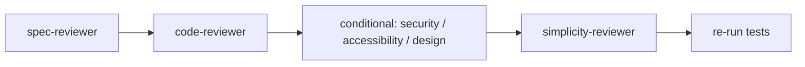
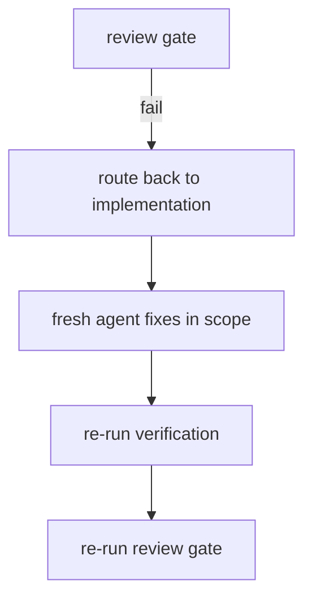

# Review Pipeline Internals

## Review Order (Fixed)

Order is non-negotiable: **correctness before style**. If the wrong thing was built, code quality is moot.

## Gate Contract

| Gate | Agent | Skill | Verdict Inputs | Blocks On |
| :--- | :--- | :--- | :--- | :--- |
| 1 | spec-reviewer | specification-compliance-review | Implementation vs spec (criteria, requirements, exclusions) | Non-compliance, scope creep, exclusion violation |
| 2 | code-reviewer | code-quality-review | Diff + conventions | Critical/major quality issues |
| 2.5 (conditional) | security/accessibility/design reviewers | their skills | Diff + domain criteria | Critical/major findings |
| 3 | simplicity-reviewer | simplicity-review | Diff + green tests + spec | Overengineering (never protected items) |

## Severity Model

Reviewers classify findings: **Critical** (must fix, blocks), **Major** (should fix, may block), **Minor** (nice to fix), **Suggestion** (optional). The task-completion gate treats critical/major as blocking.

## Evidence Requirement

Reviews verify from the **implementation**, not from the implementer's claims:

- spec-reviewer: is the criterion satisfied in the code? Is there a test?
- code-reviewer: are tests meaningful?
- simplicity-reviewer: re-run tests after any simplification.

## Hook Support

- `hooks/after-task.js` `verifyTaskGates` aggregates: functional verification, spec compliance, code quality, security (default pass), simplicity.
- `hooks/before-completion.js` `checkCompletionReadiness` gates ship.

## Failure Loop

See [agent-responsibility-matrix.md](../03-reference/agents/agent-responsibility-matrix.md) and [task-completion-gate.md](../03-reference/skills/task-completion-gate.md).
