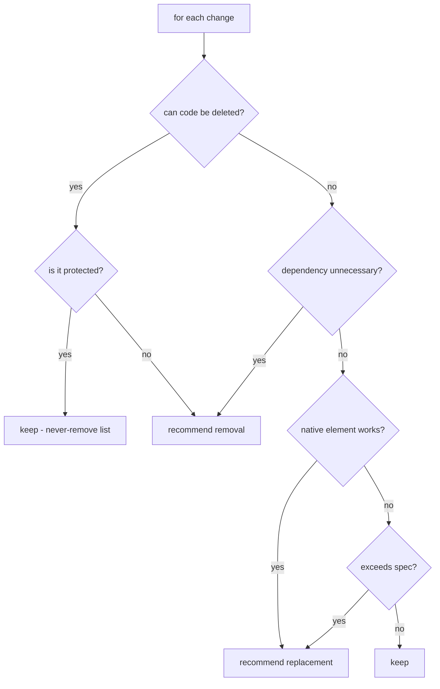

# Simplicity Ladder Internals

## The Ponytail Ladder

Before writing new code, traverse:

1. Does this need to exist?
2. Is the required behaviour already present?
3. Can existing project code be reused?
4. Can the standard library do it?
5. Can the native platform do it?
6. Can an installed dependency do it?
7. Can a small local change do it?
8. Only then create a new abstraction.

## Where It Is Enforced

| Location | Role |
| :--- | :--- |
| `AGENTS.md` | Loaded at session start (rule 11 + ladder section) |
| `agents/implementation-agent.md` | Implementer applies it before writing code |
| `agents/solution-architect-agent.md` | Design applies it to every requirement |
| `agents/simplicity-reviewer.md` | Final review applies it to the diff |
| `skills/simplicity-review/SKILL.md` | The review procedure + never-remove list |

## The Never-Remove List (Ponytail Exclusions)

The simplicity review must never recommend removing:

- Security protections
- Input validation
- Error handling
- Accessibility
- Data integrity protections
- Tests

This is enforced in the reviewer prompt and verified by `evals/simplicity-review/scenario-01-overengineering.json` (must not remove validation/error handling/tests).

## Decision Flow in Review

## Why It Runs Last

Simplification only after correctness: tests green, compliance passed, quality passed. Simplifying unverified code would confuse "simpler" with "broken".

See [simplicity-review.md](../03-reference/skills/simplicity-review.md) and [philosophy-and-engineering-principles.md](../01-overview/philosophy-and-engineering-principles.md).
