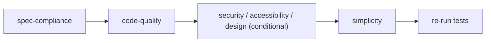

# Quality Strategy

## Quality Model

Quality is enforced at four levels:

1. **Structural** — `npm run validate` (content shape, manifest references)
2. **Documentation** — `npm run docs:validate` (coverage, links, standards)
3. **Behavioural** — `evals/` (agents produce the right outputs)
4. **Process** — the lifecycle gates (spec compliance → code quality → conditional → simplicity)

## The Review Sequence (Process Level)

## What "Done" Means

A task is done when **all** gates pass with fresh evidence:

- Acceptance criteria verified
- Tests green (unit/integration/browser)
- Spec review PASS
- Code-quality review PASS (no critical/major blockers)
- Conditional reviews PASS when triggered
- Simplicity review PASS (or simplifications applied + re-tested)

## Quality Roles

| Role | Quality Responsibility |
| :--- | :--- |
| development-conductor | Enforces gates and order |
| spec-reviewer | "Right thing?" |
| code-reviewer | "Done well?" |
| test-engineer | Fresh evidence, edge cases, regressions |
| security/accessibility/design reviewers | Domain quality when triggered |
| simplicity-reviewer | Minimum solution, protected exclusions |

## Quality of the Framework Itself

The framework dogfoods its own principles:

- Zero dependencies (restraint)
- Read-only validators
- Canonical-only edits with sync checks
- Every component documented and covered by `docs:validate`

## Coverage Intent

| Concern | Mechanism |
| :--- | :--- |
| Correctness | TDD + acceptance criteria + spec review |
| Regression | regression-testing + full suite at gates |
| Security | security-review (conditional) + threat model |
| Accessibility | accessibility-review (conditional) |
| Design | design-quality-review (conditional) |
| Simplicity | simplicity-review + Ponytail ladder |

See [quality-traceability-matrix.md](quality-traceability-matrix.md) and [release-quality-gates.md](release-quality-gates.md).
